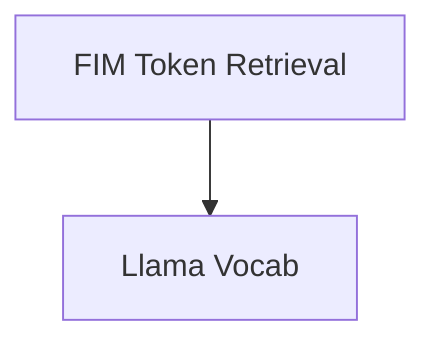

# FIM Special Tokens Module

## Introduction

The `fim_special_tokens` module is responsible for providing access to special tokens used in Fill-in-the-Middle (FIM) operations within the `llama.cpp` project. These tokens are crucial for models designed to complete text by filling in missing sections, enabling functionalities like code generation or text rephrasing.

This module acts as a wrapper around the core vocabulary functions, simplifying the retrieval of specific FIM-related tokens such as prefix, suffix, middle, padding, replacement, and separator tokens.

## Architecture Overview

The `fim_special_tokens` module primarily consists of a single sub-module that encapsulates the token retrieval logic. It interacts directly with the `llama_vocab` component (from the [llama_cpp_vocab.md](llama_cpp_vocab.md) module) to fetch the required special tokens.

<!-- DIAGRAM_JSON
{
    "direction": "TD",
    "nodes": [
        {"id": "fim_token_retrieval", "label": "FIM Token Retrieval", "type": "module", "link": "fim_token_retrieval.md"},
        {"id": "llama_vocab", "label": "Llama Vocab (External)", "type": "external"}
    ],
    "edges": [
        {"source": "fim_token_retrieval", "target": "llama_vocab"}
    ],
    "groups": []
}
-->

## Sub-modules

This module contains the following sub-module:

*   ### [FIM Token Retrieval](fim_token_retrieval.md)
    Provides functions to retrieve specific Fill-in-the-Middle (FIM) special tokens (prefix, suffix, middle, pad, replacement, separator) from the vocabulary.