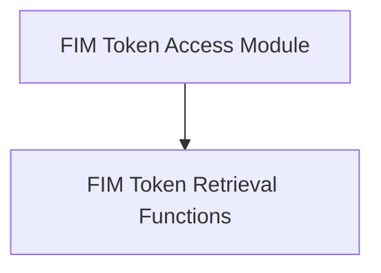

# FIM Token Access Module

The `fim_token_access` module provides direct access to specific Fill-in-the-Middle (FIM) tokens within the Llama vocabulary. These special tokens are essential for models designed to perform tasks like code completion or text infilling, where content needs to be generated at arbitrary positions within existing text.

## Architecture Overview

This module acts as a simple interface to retrieve the FIM special tokens, delegating the actual vocabulary lookup to the underlying `llama_vocab` structure. It consists primarily of functions that map directly to specific FIM token identifiers.

<!-- DIAGRAM_JSON
{
    "direction": "TD",
    "nodes": [
        {"id": "fim_token_retrieval_functions", "label": "FIM Token Retrieval Functions", "type": "module", "link": "fim_token_retrieval_functions.md"}
    ],
    "edges": [],
    "groups": []
}
-->

## Sub-modules

### [FIM Token Retrieval Functions](fim_token_retrieval_functions.md)
This sub-module encapsulates the functions responsible for retrieving individual FIM special tokens from the Llama vocabulary. Each function provides direct access to a specific token type (e.g., prefix, suffix, middle, padding, etc.), enabling precise control over FIM-aware model operations.