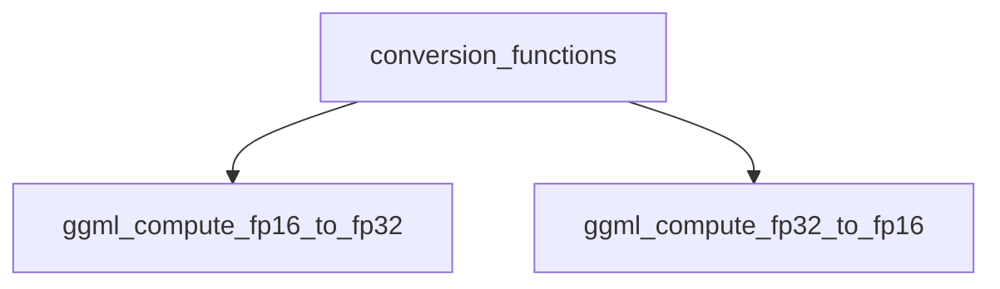

# floating_point_converters Module Documentation

## Introduction

The `floating_point_converters` module provides essential utility functions for converting between different floating-point precisions within the GGML library. Specifically, it handles the conversion of 16-bit floating-point numbers (half-precision) to 32-bit floating-point numbers (single-precision) and vice-versa. These conversions are critical for optimizing memory usage and computational performance in machine learning models, where mixed-precision training and inference are common.

## Architecture and Component Relationships

The `floating_point_converters` module is a leaf module nestled within the `conversion_functions` sub-module of `ggml_internal_utils`. It encapsulates the core logic for floating-point conversions. Its primary components are the `ggml_compute_fp16_to_fp32` and `ggml_compute_fp32_to_fp16` functions.

<!-- DIAGRAM_JSON
{
    "direction": "TD",
    "nodes": [
        {"id": "fp16_to_fp32", "label": "ggml_compute_fp16_to_fp32", "type": "component", "link": null},
        {"id": "fp32_to_fp16", "label": "ggml_compute_fp32_to_fp16", "type": "component", "link": null},
        {"id": "conversion_functions", "label": "conversion_functions", "type": "external", "link": "conversion_functions.md"}
    ],
    "edges": [
        {"source": "conversion_functions", "target": "fp16_to_fp32"},
        {"source": "conversion_functions", "target": "fp32_to_fp16"}
    ],
    "groups": []
}
-->

### Components

#### `ggml_compute_fp16_to_fp32`

This function converts a 16-bit floating-point number (`ggml_fp16_t`) to its 32-bit floating-point (`float`) equivalent. It handles special cases like denormalized numbers and uses bit manipulation to perform the conversion efficiently.

#### `ggml_compute_fp32_to_fp16`

This function converts a 32-bit floating-point number (`float`) to its 16-bit floating-point (`ggml_fp16_t`) equivalent. Similar to the `fp16_to_fp32` function, it employs bitwise operations and handles various floating-point representations, including values that would become infinity or zero when truncated to half-precision.

## How the Module Fits into the Overall System

The `floating_point_converters` module is a foundational utility within the `ggml_internal_utils` suite, providing low-level, high-performance floating-point conversion routines. These routines are leveraged by higher-level modules, such as [llama_cpp_common](llama_cpp_common.md) or [ggml_core](ggml_core.md), that deal with model quantization, mixed-precision computations, and data manipulation in general. By offering efficient and accurate conversions, this module ensures data integrity and computational efficiency across various GGML operations, particularly in contexts where memory bandwidth and computational speed are critical, such as embedded systems or large-scale model inference. It underpins the ability of GGML to work with different precision formats, contributing to its flexibility and performance characteristics.