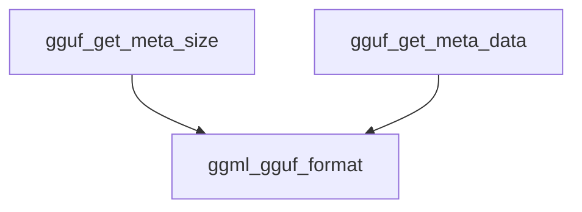

# Module: general_metadata_access

## Introduction
The `general_metadata_access` module provides fundamental utilities for interacting with the metadata section of GGUF (GGML Universal Format) files. It allows for the determination of metadata size and the retrieval of its raw binary representation, serving as a low-level interface for metadata inspection and processing within the GGUF ecosystem.

## Core Functionality

This module encapsulates functions crucial for direct access to GGUF metadata:

### `gguf_get_meta_size`
Calculates and returns the total size, in bytes, of the metadata stored within a given GGUF context. This function is essential for allocating appropriate buffer space before retrieving the metadata itself.

**Code Snippet:**
```cpp
size_t gguf_get_meta_size(const struct gguf_context * ctx) {
    // only return size
    std::vector<int8_t> buf;
    gguf_write_to_buf(ctx, buf, /*only_meta =*/ true);
    return buf.size();
}
```

### `gguf_get_meta_data`
Retrieves the raw binary data of the metadata from a GGUF context and copies it into a provided buffer. This function facilitates direct manipulation or storage of the GGUF metadata.

**Code Snippet:**
```cpp
void gguf_get_meta_data(const struct gguf_context * ctx, void * data) {
    std::vector<int8_t> buf;
    gguf_write_to_buf(ctx, buf, /*only_meta =*/ true);
    memcpy(data, buf.data(), buf.size());
}
```

## Architecture and Component Relationships

The `general_metadata_access` module's architecture is straightforward, focusing on providing direct metadata retrieval. It primarily interacts with the `ggml_gguf_format` module, specifically utilizing internal utility functions like `gguf_write_to_buf` to serialize only the metadata section of a GGUF context into a buffer.

<!-- DIAGRAM_JSON
{
    "direction": "TD",
    "nodes": [
        {"id": "gguf_get_meta_size", "label": "gguf_get_meta_size", "type": "component", "link": null},
        {"id": "gguf_get_meta_data", "label": "gguf_get_meta_data", "type": "component", "link": null},
        {"id": "ggml_gguf_format", "label": "ggml_gguf_format", "type": "external", "link": "ggml_gguf_format.md"}
    ],
    "edges": [
        {"source": "gguf_get_meta_size", "target": "ggml_gguf_format"},
        {"source": "gguf_get_meta_data", "target": "ggml_gguf_format"}
    ],
    "groups": []
}
-->


## How the Module Fits into the Overall System

This module is a leaf component within the `ggml_gguf_format` module, specifically nested under `metadata_management` and `metadata_retrieval`. Its role is to offer fundamental, low-level access to GGUF metadata, enabling other higher-level components to build functionalities like metadata validation, parsing, or display without needing to understand the intricacies of GGUF file structure. It acts as a critical bridge for any component requiring raw metadata access from a `gguf_context`.