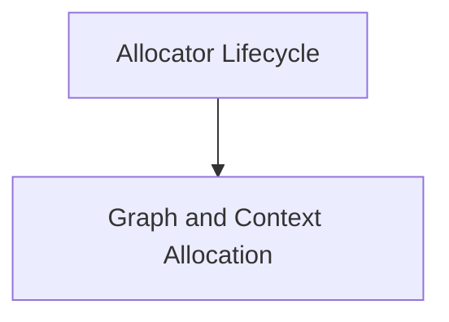

# GGML Allocator Module

## Introduction and Purpose

The `ggml_allocator` module is a crucial component within the GGML ecosystem, responsible for efficient memory management and tensor allocation, particularly for computation graphs and contexts. It provides mechanisms to allocate, reserve, and free memory buffers used by GGML operations, optimizing memory usage and performance.

## Architecture Overview

The `ggml_allocator` module interacts with various GGML components, including computation graphs (`ggml_cgraph`) and backend buffer types (`ggml_backend_buffer_type_t`). It manages a collection of virtual buffers (`ggml_vbuffer`) and dynamically allocated tensor allocators (`ggml_dyn_tallocr`) to fulfill allocation requests. The module provides functions for both graph-based and context-based tensor allocation, allowing for flexible memory strategies.

<!-- DIAGRAM_JSON
{
    "direction": "TD",
    "nodes": [
        {"id": "allocator_lifecycle", "label": "Allocator Lifecycle", "type": "module", "link": "allocator_lifecycle.md"},
        {"id": "graph_context_allocation", "label": "Graph and Context Allocation", "type": "module", "link": "graph_context_allocation.md"}
    ],
    "edges": [
        {"source": "allocator_lifecycle", "target": "graph_context_allocation"}
    ],
    "groups": []
}
-->

## High-level Functionality

### [Allocator Lifecycle](allocator_lifecycle.md)
This sub-module focuses on the core management of GGML allocator instances. It provides functions for creating new allocators, freeing their associated resources, and querying the size of the buffers they manage.

### [Graph and Context Allocation](graph_context_allocation.md)
This sub-module handles the allocation of tensors for both computation graphs and GGML contexts. It includes functions for allocating entire graphs, reserving memory based on graph requirements, and determining the necessary buffer sizes for context-based allocations.