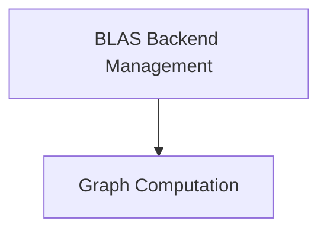

# `ggml_backend_blas` Module Documentation

## Introduction and Purpose

The `ggml_backend_blas` module provides a Basic Linear Algebra Subprograms (BLAS) accelerated backend for the GGML library. It integrates BLAS routines to optimize common linear algebra operations, such as matrix multiplication and outer products, thereby enhancing the performance of graph computations within GGML. This module enables GGML to leverage highly optimized BLAS implementations available on the host system.

## Architecture Overview

The `ggml_backend_blas` module is composed of several key sub-modules that handle backend initialization, device property retrieval, configuration, and the execution of computation graphs. It interacts with the core GGML library to provide an optimized computation environment.

<!-- DIAGRAM_JSON
{
    "direction": "TD",
    "nodes": [
        {"id": "backend_initialization_and_management", "label": "BLAS Backend Management", "type": "module", "link": "backend_initialization_and_management.md"},
        {"id": "graph_computation", "label": "Graph Computation", "type": "module", "link": "graph_computation.md"}
    ],
    "edges": [
        {"source": "backend_initialization_and_management", "target": "graph_computation"}
    ],
    "groups": []
}
-->

## High-Level Functionality

The `ggml_backend_blas` module is organized into the following sub-modules:

### [BLAS Backend Management](backend_initialization_and_management.md)
This sub-module is responsible for the overall lifecycle management of the BLAS backend. It includes functions for initializing the backend, retrieving device-specific properties, and configuring operational parameters such as the number of threads used for computations.

### [Graph Computation](graph_computation.md)
This sub-module focuses on executing computation graphs using the BLAS backend. It processes the nodes within a GGML computation graph, dispatching BLAS-optimized operations like matrix multiplication and outer products to accelerate the computation.
