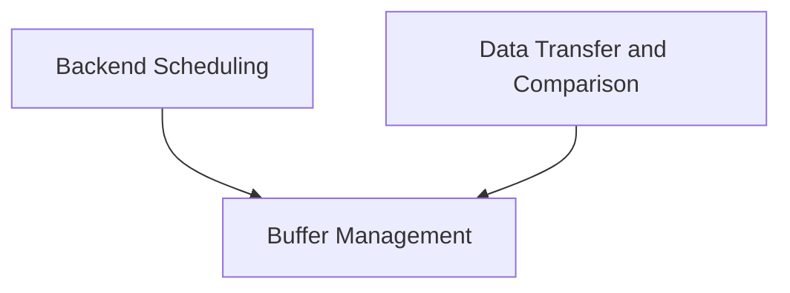

# ggml_backend_core Module Documentation

## Introduction and Purpose
The `ggml_backend_core` module provides the foundational interfaces and core functionalities for managing and interacting with various hardware backends within the GGML library. It abstracts away the complexities of device-specific operations, offering a unified API for tasks such as graph computation, memory buffer management, and data transfer. This module is critical for enabling GGML to efficiently execute machine learning workloads across diverse computing environments, from CPUs to specialized accelerators.

## Architecture Overview
The `ggml_backend_core` module is structured into several key sub-modules, each responsible for a distinct aspect of backend interaction. These sub-modules work in concert to provide a robust and flexible framework for low-level hardware operations. The architecture emphasizes modularity, allowing for easy integration of new backends and optimization strategies.

<!-- DIAGRAM_JSON
{
    "direction": "TD",
    "nodes": [
        {"id": "backend_scheduling", "label": "Backend Scheduling", "type": "module", "link": "backend_scheduling.md"},
        {"id": "buffer_management", "label": "Buffer Management", "type": "module", "link": "buffer_management.md"},
        {"id": "data_transfer_and_comparison", "label": "Data Transfer and Comparison", "type": "module", "link": "data_transfer_and_comparison.md"}
    ],
    "edges": [
        {"source": "backend_scheduling", "target": "buffer_management"},
        {"source": "data_transfer_and_comparison", "target": "buffer_management"}
    ],
    "groups": []
}
-->

## Sub-modules

### [Backend Scheduling](backend_scheduling.md)
This sub-module is responsible for orchestrating the execution of computation graphs on various backends. It includes functionalities for scheduling graph computations, reserving necessary memory resources, and initializing new backend schedulers. Its core purpose is to manage the flow of operations and ensure efficient resource allocation during graph execution.

### [Buffer Management](buffer_management.md)
This sub-module focuses on the allocation and management of memory buffers across different backends. It provides interfaces for allocating new buffers, querying buffer properties such as alignment and maximum size, and setting buffer usage flags. This ensures that memory is handled optimally and in accordance with the requirements of each specific backend.

### [Data Transfer and Comparison](data_transfer_and_comparison.md)
This sub-module handles the movement of data between backends and provides tools for verifying computation results. It includes functions for asynchronous tensor copying, which can fall back to synchronous methods, and a utility for comparing the output of a computation graph when run on two different backends. It also contains CPU-specific buffer copy and initialization routines.