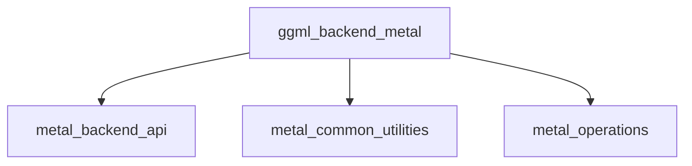

The `ggml_backend_metal` module provides a high-performance backend for the GGML library, leveraging Apple's Metal API to accelerate machine learning computations on compatible Apple hardware. It encompasses functionalities for initializing and managing Metal devices, optimizing computational graphs for Metal execution, and encoding individual or fused operations for efficient GPU processing. This module is crucial for enabling GGML to achieve optimal performance on macOS and iOS devices by directly utilizing the native GPU capabilities.

### Architecture
The `ggml_backend_metal` module is structured into several key sub-modules, each handling a specific aspect of Metal integration:

*   **`metal_backend_api`**: This sub-module provides the core interface for initializing the Metal backend, managing Metal devices, querying their properties and capabilities, and controlling runtime aspects like abort callbacks and compute capture.
*   **`metal_common_utilities`**: Focuses on graph optimization specifically for the Metal backend. It includes utilities for fusing and reordering computational graph operations to enhance concurrency and efficiency on Apple's Metal GPU framework.
*   **`metal_operations`**: Responsible for encoding individual or fused computational graph operations into Metal commands for execution on the GPU. It also handles debug group management for performance analysis and includes error checking for fused operations.

### Core Components Documentation

The `ggml_backend_metal` module and its sub-modules expose the following core components:

#### `metal_backend_api`
This module provides the primary interface for interacting with the Metal backend.
*   [`ml.backend.ggml.ggml.src.ggml-metal.ggml-metal.ggml_backend_metal_init`](metal_backend_api.md#metal_backend_initialization): Initializes the GGML Metal backend context.
*   [`ml.backend.ggml.ggml.src.ggml-metal.ggml-metal.ggml_backend_metal_device_init`](metal_backend_api.md#metal_backend_initialization): Initializes a specific Metal device for the backend.
*   [`ml.backend.ggml.ggml.src.ggml-metal.ggml-metal.ggml_backend_metal_device_get_props`](metal_backend_api.md#device_properties): Retrieves properties of a Metal device.
*   [`ml.backend.ggml.ggml.src.ggml-metal.ggml-metal.ggml_backend_metal_supports_family`](metal_backend_api.md#buffer_and_family_support): Checks if a Metal device family is supported.
*   [`ml.backend.ggml.ggml.src.ggml-metal.ggml-metal.ggml_backend_metal_capture_next_compute`](metal_backend_api.md#control_and_debugging): Enables capturing the next compute pass for debugging.
*   [`ml.backend.ggml.ggml.src.ggml-metal.ggml-metal.ggml_backend_metal_set_abort_callback`](metal_backend_api.md#control_and_debugging): Sets a callback function to handle abort signals during computation.

#### `metal_common_utilities`
This module provides graph optimization utilities.
*   [`ml.backend.ggml.ggml.src.ggml-metal.ggml-metal-common.ggml_graph_optimize`](metal_common_utilities.md#ggml_graph_optimize): Optimizes a GGML computation graph for Metal execution by fusing and reordering operations.

#### `metal_operations`
This module handles the encoding of operations for Metal.
*   [`ml.backend.ggml.ggml.src.ggml-metal.ggml-metal-ops.ggml_metal_op_encode`](metal_operations.md#ggml_metal_op_encode): Encodes a GGML operation or a fused group of operations into Metal commands.

#### External Dependencies
The `ggml_backend_metal` module interacts with the following external core modules:
*   **`ggml_core`**: Provides fundamental GGML graph structures, tensor definitions, and operation types that the Metal backend processes and executes.