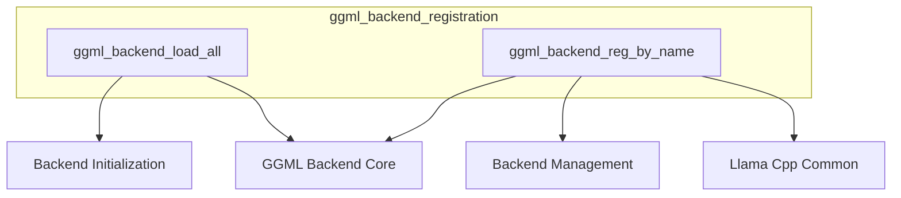

# Module: `ggml_backend_registration`

## Introduction

The `ggml_backend_registration` module is a pivotal component within the GGML framework, responsible for managing the registration and dynamic loading of various backend implementations. These backends can represent different hardware accelerators (like GPUs via Metal or Vulkan) or highly optimized CPU implementations. This module provides the core functionalities necessary to discover available backends, initialize them, and retrieve specific backend registrations by their names, enabling the system to adapt to diverse execution environments.

## Core Functionality

The `ggml_backend_registration` module offers two primary functionalities:

1.  **Backend Loading (`ggml_backend_load_all`):** This function orchestrates the loading and initialization of all available GGML backend implementations. It ensures that the system can detect and prepare all recognized backends for subsequent use, abstracting away the specifics of backend discovery and setup.

2.  **Backend Lookup (`ggml_backend_reg_by_name`):** This functionality provides a robust mechanism to query and retrieve a specific backend registration structure using its unique name. This is crucial for applications that need to dynamically select or configure a particular backend at runtime based on user preferences or system capabilities.

## Architecture and Component Relationships

### 1. `ggml_backend_load_all`

*   **Purpose:** Initiates the discovery and loading process for all GGML backend implementations.
*   **Details:** The `ggml_backend_load_all()` function internally calls `ggml_backend_load_all_from_path(nullptr)`. The use of `nullptr` typically signifies that the function will use a default mechanism or predefined paths to locate and load backends. This design allows for flexible backend discovery, either through a specified path or via a system-wide default configuration, ensuring that all available backends are prepared for operation.

### 2. `ggml_backend_reg_by_name`

*   **Purpose:** Retrieves a specific `ggml_backend_reg_t` structure by its given name.
*   **Details:** The `ggml_backend_reg_by_name(const char * name)` function performs an iterative search through all currently registered backends. It leverages `ggml_backend_reg_count()` to determine the total number of registered backends and `ggml_backend_reg_get(i)` to access each registration. A case-insensitive string comparison (`striequals`) is then used to match the provided `name` against the name of each registered backend (`ggml_backend_reg_name(reg)`). Upon finding a match, the corresponding `ggml_backend_reg_t` structure is returned; otherwise, `nullptr` is returned, indicating that no backend with the specified name was found.

### Module Relationships

The `ggml_backend_registration` module interacts closely with several other modules within the GGML ecosystem to perform its functions:

*   **[backend_management](backend_management.md):** This sub-module is likely responsible for the underlying mechanisms that maintain the registry of backends, including functions for counting and retrieving registered backend entries, which are directly utilized by `ggml_backend_reg_by_name`.

*   **[backend_initialization](backend_initialization.md):** As another direct sub-module, `backend_initialization` would contain the specific routines and logic required to initialize individual backend implementations, a process orchestrated by the `ggml_backend_load_all` function.

*   **[ggml_backend_core](ggml_backend_core.md):** This module provides the foundational definitions and structures for GGML backends, such as `ggml_backend_reg_t` and the methods to retrieve backend names, which are fundamental to the registration and lookup processes within this module.

*   **[llama_cpp_common](llama_cpp_common.md):** The `llama_cpp_common` module, particularly its string manipulation utilities, is used by `ggml_backend_reg_by_name` for performing case-insensitive comparisons of backend names (e.g., `striequals`).

<!-- DIAGRAM_JSON
{
    "direction": "TD",
    "nodes": [
        {"id": "load_all_backends", "label": "ggml_backend_load_all", "type": "component", "link": null},
        {"id": "register_by_name", "label": "ggml_backend_reg_by_name", "type": "component", "link": null},
        {"id": "backend_management_module", "label": "Backend Management", "type": "external", "link": "backend_management.md"},
        {"id": "backend_initialization_module", "label": "Backend Initialization", "type": "external", "link": "backend_initialization.md"},
        {"id": "ggml_backend_core_module", "label": "GGML Backend Core", "type": "external", "link": "ggml_backend_core.md"},
        {"id": "llama_cpp_common_module", "label": "Llama Cpp Common", "type": "external", "link": "llama_cpp_common.md"}
    ],
    "edges": [
        {"source": "load_all_backends", "target": "backend_initialization_module"},
        {"source": "register_by_name", "target": "backend_management_module"},
        {"source": "load_all_backends", "target": "ggml_backend_core_module"},
        {"source": "register_by_name", "target": "ggml_backend_core_module"},
        {"source": "register_by_name", "target": "llama_cpp_common_module"}
    ],
    "groups": [
        {"id": "ggml_backend_registration", "label": "ggml_backend_registration", "nodes": ["load_all_backends", "register_by_name"]}
    ]
}
-->
