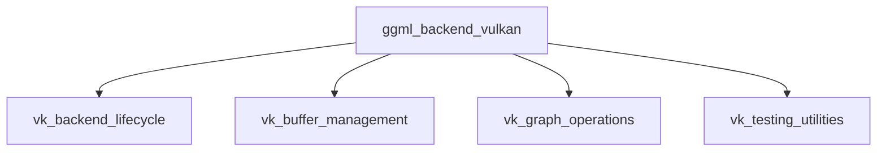

## `ggml_backend_vulkan` Module Overview

The `ggml_backend_vulkan` module provides a high-performance Vulkan backend for the GGML library, enabling GPU acceleration for machine learning computations. It manages the lifecycle of Vulkan devices, handles buffer allocation and data transfer, orchestrates computational graph execution, and includes utilities for testing Vulkan-specific operations. This module is crucial for leveraging modern GPUs to accelerate GGML workloads on Vulkan-compatible hardware.

### Architecture

The `ggml_backend_vulkan` module is structured into several key sub-modules, each responsible for a distinct set of functionalities:

### Core Components Documentation

The `ggml_backend_vulkan` module is composed of several key sub-modules, each managing specific aspects of Vulkan integration:

#### 1. `vk_backend_lifecycle`
**Description:** This sub-module is responsible for managing the lifecycle, querying capabilities, and handling synchronization of Vulkan devices. It provides foundational functions for initializing and terminating devices, retrieving properties, checking supported operations, and ensuring proper command synchronization.
**Components:**
*   `ml.backend.ggml.ggml.src.ggml-vulkan.ggml-vulkan.ggml_backend_vk_device_init`
*   `ml.backend.ggml.ggml.src.ggml-vulkan.ggml-vulkan.ggml_backend_vk_free`
*   `ml.backend.ggml.ggml.src.ggml-vulkan.ggml-vulkan.ggml_backend_vk_reg_get_device`
*   `ml.backend.ggml.ggml.src.ggml-vulkan.ggml-vulkan.ggml_backend_vk_reg_get_device_count`
*   `ml.backend.ggml.ggml.src.ggml-vulkan.ggml-vulkan.ggml_backend_vk_device_get_props`
*   `ml.backend.ggml.ggml.src.ggml-vulkan.ggml-vulkan.ggml_backend_vk_device_supports_op`
*   `ml.backend.ggml.ggml.src.ggml-vulkan.ggml-vulkan.ggml_backend_vk_synchronize`
*   `ml.backend.ggml.ggml.src.ggml-vulkan.ggml-vulkan.ggml_vk_wait_events`

#### 2. `vk_buffer_management`
**Description:** This sub-module handles comprehensive and efficient management of Vulkan device and host buffers. It provides a robust API for allocating, deallocating, and manipulating buffer data, including synchronous and asynchronous tensor data transfers and memory initialization operations.
**Components:**
*   `ml.backend.ggml.ggml.src.ggml-vulkan.ggml-vulkan.ggml_backend_vk_buffer_cpy_tensor`
*   `ml.backend.ggml.ggml.src.ggml-vulkan.ggml-vulkan.ggml_backend_vk_cpy_tensor_async`
*   `ml.backend.ggml.ggml.src.ggml-vulkan.ggml-vulkan.ggml_backend_vk_buffer_set_tensor`
*   `ml.backend.ggml.ggml.src.ggml-vulkan.ggml-vulkan.ggml_backend_vk_buffer_get_tensor`
*   `ml.backend.ggml.ggml.src.ggml-vulkan.ggml-vulkan.ggml_backend_vk_buffer_memset_tensor`
*   `ml.backend.ggml.ggml.src.ggml-vulkan.ggml-vulkan.ggml_backend_vk_buffer_clear`
*   `ml.backend.ggml.ggml.src.ggml-vulkan.ggml-vulkan.ggml_backend_vk_buffer_type_alloc_buffer`
*   `ml.backend.ggml.ggml.src.ggml-vulkan.ggml-vulkan.ggml_backend_vk_buffer_free_buffer`
*   `ml.backend.ggml.ggml.src.ggml-vulkan.ggml-vulkan.ggml_backend_vk_host_buffer_free_buffer`
*   `ml.backend.ggml.ggml.src.ggml-vulkan.ggml-vulkan.ggml_vk_buffer_write_nc_async`
*   `ml.backend.ggml.ggml.src.ggml-vulkan.ggml-vulkan.ggml_backend_vk_device_get_buffer_type`
*   `ml.backend.ggml.ggml.src.ggml-vulkan.ggml-vulkan.ggml_backend_vk_device_get_host_buffer_type`
*   `ml.backend.ggml.ggml.src.ggml-vulkan.ggml-vulkan.ggml_backend_vk_get_tensor_async`
*   `ml.backend.ggml.ggml.src.ggml-vulkan.ggml-vulkan.ggml_backend_vk_set_tensor_async`

#### 3. `vk_graph_operations`
**Description:** This sub-module contains functionalities for computing and optimizing computational graphs on Vulkan devices.
**Components:**
*   `ml.backend.ggml.ggml.src.ggml-vulkan.ggml-vulkan.ggml_backend_vk_graph_compute`
*   `ml.backend.ggml.ggml.src.ggml-vulkan.ggml-vulkan.ggml_vk_graph_optimize`

#### 4. `vk_testing_utilities`
**Description:** This sub-module provides utility functions for testing Vulkan-specific operations, such as matrix multiplication and dequantization.
**Components:**
*   `ml.backend.ggml.ggml.src.ggml-vulkan.ggml-vulkan.ggml_vk_test_matmul`
*   `ml.backend.ggml.ggml.src.ggml-vulkan.ggml-vulkan.ggml_vk_test_dequant`