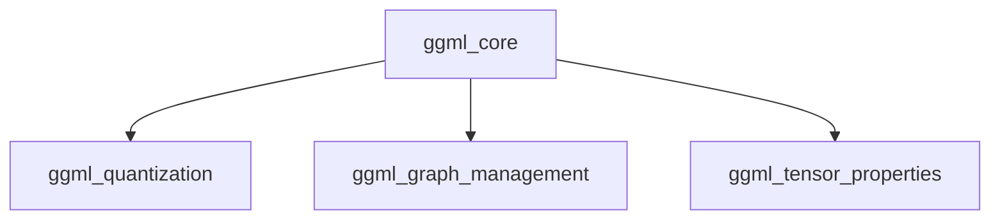

## Overview of `ggml_core` Module

### Purpose of the Module

The `ggml_core` module is the foundational component of the GGML library, providing the core functionalities for tensor operations, computation graph management, and memory handling. It serves as the bedrock for building and executing machine learning models efficiently on various hardware backends. This module encapsulates the fundamental data structures, mathematical operations, and graph manipulation capabilities that enable GGML's lightweight and high-performance machine learning inference.

### Architecture of the Module

The `ggml_core` module is logically structured into three main sub-modules, each responsible for a distinct aspect of the core GGML functionality:

-   **`ggml_quantization`**: Manages the efficient quantization of floating-point data into various lower-precision GGML formats, crucial for memory reduction and accelerated inference.
-   **`ggml_graph_management`**: Handles the definition, manipulation, and lifecycle management of computation graphs, including automatic differentiation and graph state operations.
-   **`ggml_tensor_properties`**: Provides utilities for managing and querying the intrinsic memory layout and sizing characteristics of `ggml_tensor` objects, ensuring efficient memory access and data handling.

### References to Core Components Documentation

The `ggml_core` module exposes a variety of functions and interacts with its sub-modules to provide its core capabilities.

**Core Functions within `ggml_core`:**

*   [`ggml_quantize_chunk`](ggml_quantize_chunk.md): Quantizes a chunk of floating-point data to a specified GGML quantization type.
*   [`ggml_build_backward_expand`](ggml_build_backward_expand.md): Constructs the backward pass of a computation graph for automatic differentiation.
*   [`ggml_quantize_free`](ggml_quantize_free.md): Frees resources associated with a specific GGML quantization type.
*   [`ggml_graph_cpy`](ggml_graph_cpy.md): Performs a deep copy of a computation graph.
*   [`ggml_graph_dump_dot`](ggml_graph_dump_dot.md): Generates a Graphviz DOT representation of the computation graph for visualization.
*   [`ggml_is_contiguously_allocated`](ggml_is_contiguously_allocated.md): Checks if a tensor's entire memory block is contiguously allocated.
*   [`ggml_graph_overhead`](ggml_graph_overhead.md): Calculates the total memory overhead required by a computation graph.
*   [`ggml_nbytes_pad`](ggml_nbytes_pad.md): Calculates the padded number of bytes required for a tensor.
*   [`ggml_is_contiguous_1`](ggml_is_contiguous_1.md): Determines if a tensor is contiguous along its first dimension.
*   [`ggml_is_contiguous_2`](ggml_is_contiguous_2.md): Determines if a tensor is contiguous along its first two dimensions.
*   [`ggml_get_max_tensor_size`](ggml_get_max_tensor_size.md): Retrieves the maximum tensor size that can be allocated within a given context.
*   [`ggml_is_contiguous_rows`](ggml_is_contiguous_rows.md): Checks if a tensor's rows are physically contiguous in memory.
*   [`ggml_can_repeat_rows`](ggml_can_repeat_rows.md): Determines if the dimensions of two tensors allow for row repetition in operations.
*   [`ggml_graph_reset`](ggml_graph_reset.md): Resets the internal state of a computation graph, typically clearing gradients.

**Sub-modules:**

*   [`ggml_quantization`](ggml_quantization.md): Detailed documentation for quantization functionalities.
*   [`ggml_graph_management`](ggml_graph_management.md): Detailed documentation for computation graph operations.
*   [`ggml_tensor_properties`](ggml_tensor_properties.md): Detailed documentation for tensor memory and layout properties.