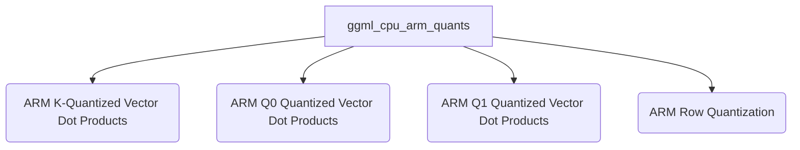

# `ggml_cpu_arm_quants` Module Overview

## Purpose of the Module

The `ggml_cpu_arm_quants` module is a critical component within the GGML (GGML Machine Learning) library, specifically designed to provide highly optimized quantization and vector dot product implementations for ARM-based CPUs. It leverages ARM NEON intrinsics to accelerate neural network inference by efficiently handling various low-bit and integer quantization schemes (such as Q2_K, Q3_K, Q4_K, Q5_K, Q6_K, IQ1_K, IQ2_K, IQ3_K, IQ4_K, TQ1_0, TQ2_0, MXFP4, IQ4_NL, Q4_0, Q5_0, Q8_0, Q4_1, Q5_1, Q8_1). This module is essential for enabling faster computation and reduced memory footprint of machine learning models on resource-constrained ARM devices.

## Architecture

The `ggml_cpu_arm_quants` module is structured into several specialized sub-modules, each focusing on a distinct category of quantized operations. This modular design allows for targeted optimizations and clear separation of concerns, ensuring efficient processing across different quantization types.

## Core Components Documentation

The `ggml_cpu_arm_quants` module encompasses a wide array of highly optimized functions for quantized operations. Key components include:

*   [`ggml_vec_dot_q4_K_q8_K`](ggml_vec_dot_q4_K_q8_K.md): Computes the dot product between Q4_K and Q8_K quantized vectors.
*   [`ggml_vec_dot_q6_K_q8_K`](ggml_vec_dot_q6_K_q8_K.md): Computes the dot product between Q6_K and Q8_K quantized vectors.
*   [`ggml_vec_dot_iq2_xs_q8_K`](ggml_vec_dot_iq2_xs_q8_K.md): Computes the dot product between IQ2_XS and Q8_K quantized vectors.
*   [`ggml_vec_dot_q5_K_q8_K`](ggml_vec_dot_q5_K_q8_K.md): Computes the dot product between Q5_K and Q8_K quantized vectors.
*   [`ggml_vec_dot_iq2_s_q8_K`](ggml_vec_dot_iq2_s_q8_K.md): Computes the dot product between IQ2_S and Q8_K quantized vectors.
*   [`ggml_vec_dot_iq3_s_q8_K`](ggml_vec_dot_iq3_s_q8_K.md): Computes the dot product between IQ3_S and Q8_K quantized vectors.
*   [`ggml_vec_dot_iq4_xs_q8_K`](ggml_vec_dot_iq4_xs_q8_K.md): Computes the dot product between IQ4_XS and Q8_K quantized vectors.
*   [`ggml_vec_dot_q2_K_q8_K`](ggml_vec_dot_q2_K_q8_K.md): Computes the dot product between Q2_K and Q8_K quantized vectors.
*   [`ggml_vec_dot_q3_K_q8_K`](ggml_vec_dot_q3_K_q8_K.md): Computes the dot product between Q3_K and Q8_K quantized vectors.
*   [`ggml_vec_dot_iq1_m_q8_K`](ggml_vec_dot_iq1_m_q8_K.md): Computes the dot product between IQ1_M and Q8_K quantized vectors.
*   [`quantize_row_q8_1`](quantize_row_q8_1.md): Quantizes a row of floating-point numbers to the Q8_1 format.
*   [`ggml_vec_dot_iq2_xxs_q8_K`](ggml_vec_dot_iq2_xxs_q8_K.md): Computes the dot product between IQ2_XXS and Q8_K quantized vectors.
*   [`ggml_vec_dot_iq3_xxs_q8_K`](ggml_vec_dot_iq3_xxs_q8_K.md): Computes the dot product between IQ3_XXS and Q8_K quantized vectors.
*   [`ggml_vec_dot_iq1_s_q8_K`](ggml_vec_dot_iq1_s_q8_K.md): Computes the dot product between IQ1_S and Q8_K quantized vectors.
*   [`quantize_row_q8_0`](quantize_row_q8_0.md): Quantizes a row of floating-point numbers to the Q8_0 format.
*   [`ggml_vec_dot_q4_0_q8_0`](ggml_vec_dot_q4_0_q8_0.md): Computes the dot product between Q4_0 and Q8_0 quantized vectors.
*   [`ggml_vec_dot_mxfp4_q8_0`](ggml_vec_dot_mxfp4_q8_0.md): Computes the dot product between MXFP4 and Q8_0 quantized vectors.
*   [`ggml_vec_dot_q8_0_q8_0`](ggml_vec_dot_q8_0_q8_0.md): Computes the dot product between Q8_0 and Q8_0 quantized vectors.
*   [`ggml_vec_dot_tq1_0_q8_K`](ggml_vec_dot_tq1_0_q8_K.md): Computes the dot product between TQ1_0 and Q8_K quantized vectors.
*   [`ggml_vec_dot_tq2_0_q8_K`](ggml_vec_dot_tq2_0_q8_K.md): Computes the dot product between TQ2_0 and Q8_K quantized vectors.
*   [`ggml_vec_dot_iq4_nl_q8_0`](ggml_vec_dot_iq4_nl_q8_0.md): Computes the dot product between IQ4_NL and Q8_0 quantized vectors.
*   [`quantize_row_q8_K`](quantize_row_q8_K.md): Quantizes a row of floating-point numbers to the Q8_K format.
*   [`ggml_vec_dot_q4_1_q8_1`](ggml_vec_dot_q4_1_q8_1.md): Computes the dot product between Q4_1 and Q8_1 quantized vectors.
*   [`ggml_vec_dot_q5_0_q8_0`](ggml_vec_dot_q5_0_q8_0.md): Computes the dot product between Q5_0 and Q8_0 quantized vectors.
*   [`ggml_vec_dot_q5_1_q8_1`](ggml_vec_dot_q5_1_q8_1.md): Computes the dot product between Q5_1 and Q8_1 quantized vectors.