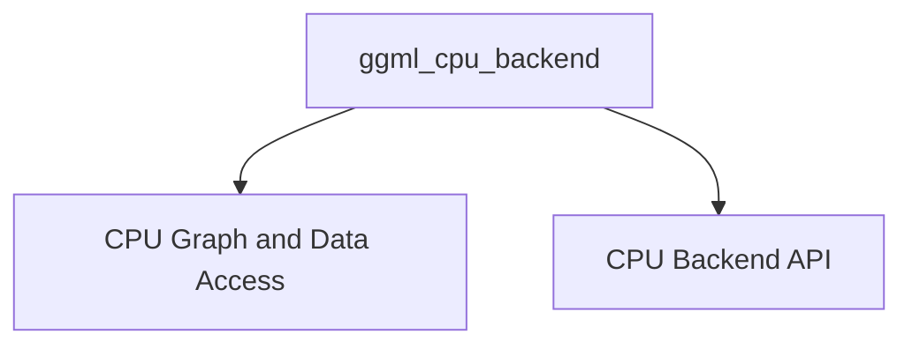

# Module: `ggml_cpu_backend`

## Purpose of the Module

The `ggml_cpu_backend` module provides the core implementation for running GGML (GGML Machine Learning) computational graphs and tensor operations efficiently on the CPU. It serves as the primary backend for GGML when no specialized hardware accelerators (like Metal or Vulkan) are available or explicitly chosen. This module is responsible for orchestrating graph execution, managing memory access, handling tensor data manipulation, and configuring CPU-specific operational parameters to optimize performance for machine learning inference and training tasks on general-purpose CPUs.

## Architecture of the Module

The `ggml_cpu_backend` module is structured into two primary sub-modules: `CPU Graph and Data Access` and `CPU Backend API`. These sub-modules work in conjunction to manage the execution of computational graphs and provide a robust interface for CPU-specific operations within the GGML framework.

## References to Core Components Documentation

### [CPU Graph and Data Access](cpu_graph_and_data_access.md)

This sub-module is a core component within the `ggml_cpu_backend` responsible for managing computational graph execution, optimizing memory access, and providing efficient tensor data manipulation on the CPU. It plays a crucial role in the performance of GGML operations by orchestrating how computational graphs are processed and how data is accessed and modified in memory.

**Key Components:**
*   `ml.backend.ggml.ggml.src.ggml-cpu.ggml-cpu.ggml_graph_compute_with_ctx`: Manages the execution of computation graphs with a given context.
*   `ml.backend.ggml.ggml.src.ggml-cpu.ggml-cpu.ggml_graph_compute_secondary_thread`: Handles computation on secondary threads for parallel processing.
*   `ml.backend.ggml.ggml.src.ggml-cpu.ggml-cpu.ggml_get_i32_1d`: Retrieves a 32-bit integer from a 1D tensor.
*   `ml.backend.ggml.ggml.src.ggml-cpu.ggml-cpu.ggml_set_i32_1d`: Sets a 32-bit integer in a 1D tensor.
*   `ml.backend.ggml.ggml.src.ggml-cpu.ggml-cpu.ggml_get_f32_1d`: Retrieves a 32-bit float from a 1D tensor.
*   `ml.backend.ggml.ggml.src.ggml-cpu.ggml-cpu.ggml_set_f32_1d`: Sets a 32-bit float in a 1D tensor.
*   `ml.backend.ggml.ggml.src.ggml-cpu.ggml-cpu.ggml_numa_init`: Initializes Non-Uniform Memory Access (NUMA) settings for memory optimization.

### [CPU Backend API](cpu_backend_api.md)

This sub-module provides the core interface for interacting with the GGML CPU backend. It encapsulates functionalities for initializing the CPU device, managing graph execution plans, and configuring operational parameters like thread counts and abort callbacks. This module is crucial for enabling efficient computation on the CPU, serving as the bridge between the higher-level GGML framework and the underlying CPU hardware.

**Key Components:**
*   `ml.backend.ggml.ggml.src.ggml-cpu.ggml-cpu.ggml_backend_cpu_device_init_backend`: Initializes the CPU backend device.
*   `ml.backend.ggml.ggml.src.ggml-cpu.ggml-cpu.ggml_backend_cpu_graph_plan_create`: Creates a computation graph plan for the CPU backend.
*   `ml.backend.ggml.ggml.src.ggml-cpu.ggml-cpu.ggml_backend_cpu_set_n_threads`: Sets the number of threads for CPU computations.
*   `ml.backend.ggml.ggml.src.ggml-cpu.ggml-cpu.ggml_backend_cpu_set_threadpool`: Configures the thread pool for the CPU backend.
*   `ml.backend.ggml.ggml.src.ggml-cpu.ggml-cpu.ggml_backend_cpu_set_abort_callback`: Sets a callback function to handle computation abort signals.
*   `ml.backend.ggml.ggml.src.ggml-cpu.ggml-cpu.ggml_backend_cpu_device_get_props`: Retrieves properties of the CPU backend device.