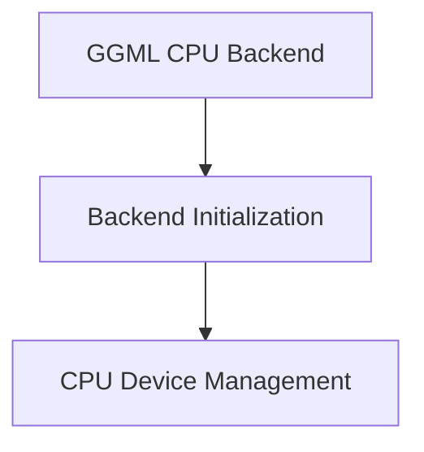

# GGML CPU Backend Initialization Module

The `backend_initialization` module, nested within the `ggml_cpu_backend`, is pivotal for setting up and querying the properties of the CPU backend device in the GGML framework. It provides essential functionalities for initializing the CPU backend and retrieving its operational characteristics and capabilities.

## Architecture Overview

The `backend_initialization` module is structured around managing the CPU device's lifecycle and capabilities. It interacts closely with its parent `ggml_cpu_backend` to ensure proper integration and functionality.

<!-- DIAGRAM_JSON
{
    "direction": "TD",
    "nodes": [
        {"id": "ggml_cpu_backend", "label": "GGML CPU Backend", "type": "external"},
        {"id": "backend_initialization", "label": "Backend Initialization", "type": "module"},
        {"id": "cpu_device_management", "label": "CPU Device Management", "type": "module", "link": "cpu_device_management.md"}
    ],
    "edges": [
        {"source": "ggml_cpu_backend", "target": "backend_initialization"},
        {"source": "backend_initialization", "target": "cpu_device_management"}
    ],
    "groups": []
}
-->

## Sub-modules

### [CPU Device Management](cpu_device_management.md)
This sub-module focuses on the core tasks of initializing the CPU backend and providing access to its properties, such as name, description, memory, and operational capabilities.