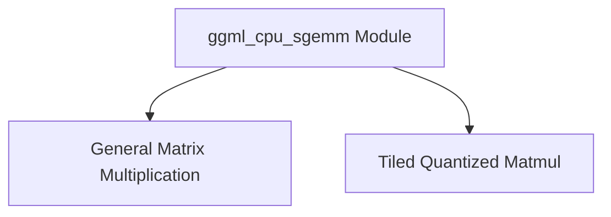

# ggml_cpu_sgemm Module Documentation

## Introduction and Purpose

The `ggml_cpu_sgemm` module is a crucial component within the GGML library, focusing on highly optimized single-precision general matrix multiplication (SGEMM) operations specifically for CPU architectures. It is designed to provide efficient computational kernels for machine learning workloads, particularly those involving quantized tensors. The module aims to leverage specific CPU features and tiling strategies to maximize performance.

## Architecture Overview

The `ggml_cpu_sgemm` module's architecture is centered around two core functionalities: a general framework for orchestrating matrix multiplication operations and a specialized routine for handling tiled and quantized matrix multiplication. This design allows for both flexibility in general GEMM tasks and high optimization for specific quantized scenarios. The module integrates data packing mechanisms to prepare tensors for efficient processing by underlying kernels.

<!-- DIAGRAM_JSON
{
    "direction": "TD",
    "nodes": [
        {"id": "ggml_cpu_sgemm", "label": "ggml_cpu_sgemm Module", "type": "module"},
        {"id": "general_matrix_multiplication", "label": "General Matrix Multiplication", "type": "module", "link": "general_matrix_multiplication.md"},
        {"id": "tiled_matrix_multiplication", "label": "Tiled Quantized Matmul", "type": "module", "link": "tiled_matrix_multiplication.md"}
    ],
    "edges": [
        {"source": "ggml_cpu_sgemm", "target": "general_matrix_multiplication"},
        {"source": "ggml_cpu_sgemm", "target": "tiled_matrix_multiplication"}
    ],
    "groups": []
}
-->

## High-Level Functionality

### [General Matrix Multiplication](general_matrix_multiplication.md)
This sub-module provides the `gemm` function, which serves as a general framework for performing matrix multiplication. It manages the iteration over matrix tiles and dispatches to appropriate low-level kernels for the actual computation. It ensures that matrix operations are carried out efficiently by organizing the work into manageable units.

### [Tiled Quantized Matmul](tiled_matrix_multiplication.md)
This sub-module encapsulates the `matmul_tiled_q0` function, which is responsible for highly optimized tiled matrix multiplication, specifically for quantized tensors (e.g., Q0 and Q4_0). It includes crucial data packing logic to prepare the input matrices for the specialized `KERNEL_Q0` operation, ensuring performance benefits on architectures like PowerPC.
