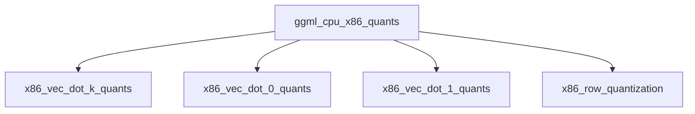

# `ggml_cpu_x86_quants` Module Overview

## Purpose of the Module

The `ggml_cpu_x86_quants` module is a critical component within the GGML CPU backend, specifically designed to provide highly optimized implementations for various quantized vector dot product operations and row-wise quantization tailored for x86 architectures. This module leverages advanced CPU instruction sets like AVX, AVX2, and SSSE3 to accelerate computations for quantized neural networks, significantly improving performance and efficiency for CPU-based inference. It supports a wide range of quantization schemes, including standard Qx_0, Qx_1, and Qx_K formats, as well as integer (IQx) and tiny (TQx) quantizations.

## Architecture of the Module

The `ggml_cpu_x86_quants` module is structured into several sub-modules, each specializing in a particular category of quantized operations. This modular design allows for targeted optimizations and clear organization of the various quantization kernels.

## References to Core Components Documentation

The `ggml_cpu_x86_quants` module and its sub-modules expose the following core components:

*   **x86 K-Quantized Vector Dot Products (`x86_vec_dot_k_quants.md`)**:
    *   [`ggml_vec_dot_q2_K_q8_K`](ggml_vec_dot_q2_K_q8_K.md): Optimized dot product for Q2_K and Q8_K quantized tensors.
    *   [`ggml_vec_dot_q3_K_q8_K`](ggml_vec_dot_q3_K_q8_K.md): Optimized dot product for Q3_K and Q8_K quantized tensors.
    *   [`ggml_vec_dot_q4_K_q8_K`](ggml_vec_dot_q4_K_q8_K.md): Optimized dot product for Q4_K and Q8_K quantized tensors.
    *   [`ggml_vec_dot_q5_K_q8_K`](ggml_vec_dot_q5_K_q8_K.md): Optimized dot product for Q5_K and Q8_K quantized tensors.
    *   [`ggml_vec_dot_q6_K_q8_K`](ggml_vec_dot_q6_K_q8_K.md): Optimized dot product for Q6_K and Q8_K quantized tensors.
    *   [`ggml_vec_dot_iq1_s_q8_K`](ggml_vec_dot_iq1_s_q8_K.md): Optimized dot product for IQ1_S and Q8_K quantized tensors.
    *   [`ggml_vec_dot_iq1_m_q8_K`](ggml_vec_dot_iq1_m_q8_K.md): Optimized dot product for IQ1_M and Q8_K quantized tensors.
    *   [`ggml_vec_dot_iq2_xs_q8_K`](ggml_vec_dot_iq2_xs_q8_K.md): Optimized dot product for IQ2_XS and Q8_K quantized tensors.
    *   [`ggml_vec_dot_iq2_s_q8_K`](ggml_vec_dot_iq2_s_q8_K.md): Optimized dot product for IQ2_S and Q8_K quantized tensors.
    *   [`ggml_vec_dot_iq2_xxs_q8_K`](ggml_vec_dot_iq2_xxs_q8_K.md): Optimized dot product for IQ2_XXS and Q8_K quantized tensors.
    *   [`ggml_vec_dot_iq3_xxs_q8_K`](ggml_vec_dot_iq3_xxs_q8_K.md): Optimized dot product for IQ3_XXS and Q8_K quantized tensors.
    *   [`ggml_vec_dot_iq3_s_q8_K`](ggml_vec_dot_iq3_s_q8_K.md): Optimized dot product for IQ3_S and Q8_K quantized tensors.
    *   [`ggml_vec_dot_iq4_xs_q8_K`](ggml_vec_dot_iq4_xs_q8_K.md): Optimized dot product for IQ4_XS and Q8_K quantized tensors.
    *   [`ggml_vec_dot_tq1_0_q8_K`](ggml_vec_dot_tq1_0_q8_K.md): Optimized dot product for TQ1_0 and Q8_K quantized tensors.
    *   [`ggml_vec_dot_tq2_0_q8_K`](ggml_vec_dot_tq2_0_q8_K.md): Optimized dot product for TQ2_0 and Q8_K quantized tensors.

*   **x86 Q0 Quantized Vector Dot Products (`x86_vec_dot_0_quants.md`)**:
    *   [`ggml_vec_dot_q4_0_q8_0`](ggml_vec_dot_q4_0_q8_0.md): Implements vector dot product operations for Q4_0 quantized blocks against Q8_0 blocks, optimized for x86 architectures.
    *   [`ggml_vec_dot_q5_0_q8_0`](ggml_vec_dot_q5_0_q8_0.md): Implements vector dot product operations for Q5_0 quantized blocks against Q8_0 blocks, optimized for x86 architectures.
    *   [`ggml_vec_dot_q8_0_q8_0`](ggml_vec_dot_q8_0_q8_0.md): Implements vector dot product operations for Q8_0 quantized blocks against Q8_0 blocks, optimized for x86 architectures.
    *   [`ggml_vec_dot_mxfp4_q8_0`](ggml_vec_dot_mxfp4_q8_0.md): Implements vector dot products for MXFP4 quantized inputs with Q8_0 quantized vectors, optimized for x86 CPUs utilizing AVX and AVX2 instructions.
    *   [`ggml_vec_dot_iq4_nl_q8_0`](ggml_vec_dot_iq4_nl_q8_0.md): Provides vector dot product operations for IQ4_NL quantized inputs with Q8_0 quantized vectors, leveraging x86 CPU optimizations, including AVX and AVX2.

*   **x86 Q1 Quantized Vector Dot Products (`x86_vec_dot_1_quants.md`)**:
    *   [`ggml_vec_dot_q5_1_q8_1`](ggml_vec_dot_q5_1_q8_1.md): Provides the quantized dot product for Q5_1 and Q8_1 block types, optimized for x86 architecture using AVX/AVX2 intrinsics.
    *   [`ggml_vec_dot_q4_1_q8_1`](ggml_vec_dot_q4_1_q8_1.md): Implements the quantized dot product for Q4_1 and Q8_1 block types optimized for x86 architecture, with optional support for AVX/AVX2.

*   **x86 Row Quantization (`x86_row_quantization.md`)**:
    *   [`quantize_row_q8_1`](quantize_row_q8_1.md): Provides core functions for row-wise quantization using Q8_1 format, optimized for x86 architectures.
    *   [`quantize_row_q8_K`](quantize_row_q8_K.md): Provides core functions for row-wise quantization using Q8_K format, optimized for x86 architectures.