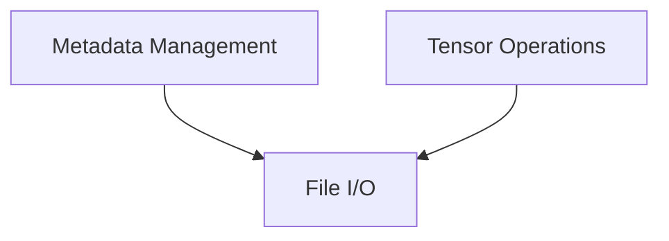

# GGUF Format Module

The `ggml_gguf_format` module is responsible for handling the GGUF (GGML Universal Format) file format, which is used for storing and distributing GGML models. This module provides essential functionalities for managing metadata, adding and manipulating tensors, and writing the GGUF context to files. It serves as the core interface for interacting with GGUF files.

## Architecture Overview

The `ggml_gguf_format` module is structured into several key sub-modules, each focusing on a specific aspect of GGUF file handling:

<!-- DIAGRAM_JSON
{
    "direction": "TD",
    "nodes": [
        {"id": "metadata_management", "label": "Metadata Management", "type": "module", "link": "metadata_management.md"},
        {"id": "tensor_operations", "label": "Tensor Operations", "type": "module", "link": "tensor_operations.md"},
        {"id": "file_io", "label": "File I/O", "type": "module", "link": "file_io.md"}
    ],
    "edges": [
        {"source": "metadata_management", "target": "file_io"},
        {"source": "tensor_operations", "target": "file_io"}
    ],
    "groups": []
}
-->

## Sub-modules

### [Metadata Management](metadata_management.md)
This sub-module is dedicated to managing the key-value metadata within a GGUF context. It provides functions to set various data types as key-value pairs and retrieve scalar values based on their key IDs.

### [Tensor Operations](tensor_operations.md)
This sub-module handles the core operations related to tensors within the GGUF format. It allows for the addition of new tensors to the GGUF context, modification of existing tensor types, and assignment of data to tensors.

### [File I/O](file_io.md)
This sub-module provides the functionality for writing the complete GGUF context, including both metadata and tensor information, to a specified file. It ensures proper file handling and error management during the write process.
