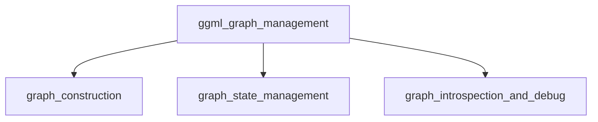

## `ggml_graph_management` Module Overview

The `ggml_graph_management` module is a fundamental component within the `ggml_core` library, dedicated to the definition, manipulation, and lifecycle management of computation graphs. It provides essential functionalities for building and traversing graphs, enabling automatic differentiation, managing graph state, and offering tools for introspection and debugging. This module is critical for constructing and executing complex neural network operations efficiently within the GGML framework.

### Purpose of the Module

The primary purpose of `ggml_graph_management` is to provide a robust set of tools for working with computation graphs. This includes:
*   **Backward Graph Construction**: Facilitating the creation of backward passes for automatic differentiation, crucial for training machine learning models.
*   **Graph State Management**: Enabling operations like copying and resetting graph states, which are vital for iterative training processes or model serialization.
*   **Graph Introspection and Debugging**: Offering utilities to visualize graph structures (e.g., DOT format) and calculate their memory overhead, aiding in performance optimization and error detection.

### Architecture of the Module

The `ggml_graph_management` module is structured into several key sub-modules, each handling a specific aspect of graph management:

### References to Core Components Documentation

The `ggml_graph_management` module exposes several core functions and interacts with other GGML modules:

**Core Components within `ggml_graph_management`:**
*   [`ggml_build_backward_expand`](graph_construction.md#ggml_build_backward_expand): Constructs the backward pass of a computation graph, identifying trainable parameters and allocating gradient accumulators.
*   [`ggml_graph_cpy`](graph_state_management.md#ggml_graph_cpy): Performs a deep copy of a computation graph, including all its nodes, leafs, and associated gradient information.
*   [`ggml_graph_dump_dot`](graph_introspection_and_debug.md#ggml_graph_dump_dot): Generates a Graphviz DOT representation of the computation graph, useful for visualization and debugging.
*   [`ggml_graph_overhead`](graph_introspection_and_debug.md#ggml_graph_overhead): Calculates the total memory overhead required by a computation graph.
*   [`ggml_graph_reset`](graph_state_management.md#ggml_graph_reset): Resets the internal state of a computation graph, typically clearing gradients and optimizer-related momenta.

**Related Modules:**
*   **[ggml_core](ggml_core.md)**: The foundational module providing core tensor operations and context management, which `ggml_graph_management` builds upon.
*   **[ggml_internal_utils](ggml_internal_utils.md)**: Provides internal utility functions used during graph construction and manipulation.
*   **[ggml_optimizer](ggml_optimizer.md)**: Leverages the backward graphs generated by this module to perform parameter updates during model training.
*   **[ggml_allocator](ggml_allocator.md)**: Manages the memory allocation for tensors and graph structures.
*   **[ggml_backend_core](ggml_backend_core.md)**: Interacts with computation graphs for execution on various hardware backends.