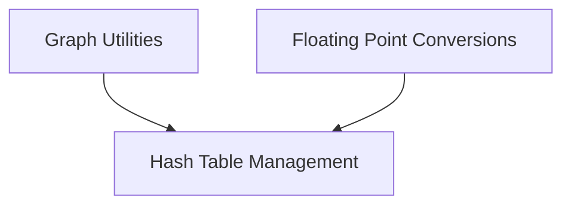

# GGML Internal Utilities Module Documentation

## Introduction

The `ggml_internal_utils` module provides a collection of internal utility functions essential for the core operations of the GGML (GGML is a C library for machine learning) framework. These utilities range from low-level floating-point conversions and hash table management to graph analysis, forming the bedrock for more complex machine learning computations.

## Architecture Overview

This module is structured into several sub-modules, each encapsulating specific utility functionalities. The relationships and dependencies between these sub-modules are illustrated in the diagram below:

<!-- DIAGRAM_JSON
{
    "direction": "TD",
    "nodes": [
        {"id": "floating_point_conversions", "label": "Floating Point Conversions", "type": "module", "link": "floating_point_conversions.md"},
        {"id": "graph_utilities", "label": "Graph Utilities", "type": "module", "link": "graph_utilities.md"},
        {"id": "hash_table_management", "label": "Hash Table Management", "type": "module", "link": "hash_table_management.md"}
    ],
    "edges": [
        {"source": "graph_utilities", "target": "hash_table_management"},
        {"source": "floating_point_conversions", "target": "hash_table_management"}
    ],
    "groups": []
}
-->

## Sub-modules

### [Floating Point Conversions](floating_point_conversions.md)

This sub-module is responsible for handling efficient conversions between different floating-point precisions, such as FP16 and FP32. These conversions are critical for optimizing memory usage and computational speed in machine learning models, especially on hardware that supports mixed-precision arithmetic.

### [Graph Utilities](graph_utilities.md)

The `graph_utilities` sub-module provides functions for analyzing and manipulating the computation graphs used within the GGML framework. It includes capabilities like determining if a sequence of graph nodes can be fused into a single subgraph operation, which is vital for graph optimization and performance.

### [Hash Table Management](hash_table_management.md)

This sub-module offers core functionalities for managing hash sets, which are used for efficient lookup and storage of `ggml_tensor` objects. It includes operations such as checking for the existence of a key and inserting new keys into the hash table, ensuring fast access to tensor metadata. 