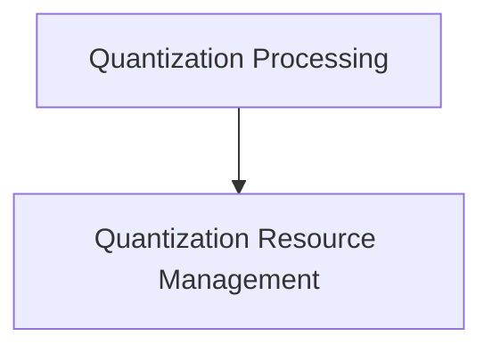

# ggml_quantization Module Documentation

## Introduction and Purpose

The `ggml_quantization` module is a critical component within the GGML library, primarily responsible for the efficient quantization of floating-point data into various lower-precision GGML formats. This process is fundamental for reducing the memory footprint and accelerating inference times of large language models and other neural network architectures by enabling operations on quantized weights and activations. It supports a wide range of quantization schemes, including different bit-widths and specialized formats, to balance precision and performance effectively.

## Architecture Overview

The `ggml_quantization` module is logically divided into two key sub-modules, each handling a distinct aspect of the quantization process:

1.  **Quantization Processing**: This sub-module encapsulates the core algorithms and functions for performing the actual data quantization. It takes floating-point input and converts it into the chosen quantized format, managing the chunk-by-chunk processing required for large tensors.
2.  **Quantization Resource Management**: This sub-module is dedicated to the proper cleanup and deallocation of any resources (e.g., lookup tables, temporary buffers) that might be allocated or used during the quantization process for specific GGML types.

These sub-modules work in concert to provide a robust and efficient quantization solution. The processing component performs the heavy lifting of data transformation, while the resource management component ensures that system resources are reclaimed responsibly.

<!-- DIAGRAM_JSON
{
    "direction": "TD",
    "nodes": [
        {"id": "quantization_processing", "label": "Quantization Processing", "type": "module", "link": "quantization_processing.md"},
        {"id": "quantization_resource_management", "label": "Quantization Resource Management", "type": "module", "link": "quantization_resource_management.md"}
    ],
    "edges": [
        {"source": "quantization_processing", "target": "quantization_resource_management"}
    ],
    "groups": []
}
-->

## High-Level Functionality

### [Quantization Processing](quantization_processing.md)

This sub-module provides the primary interface for quantizing chunks of data. It supports a diverse set of GGML quantization types, allowing developers to select the most appropriate format for their specific use case. The `ggml_quantize_chunk` function, a core component, handles the transformation from 32-bit floating-point values to the target quantized representation, including specialized integer and mixed-precision formats.

### [Quantization Resource Management](quantization_resource_management.md)

Responsible for ensuring memory hygiene, this sub-module offers functions to free up resources that may have been allocated by various quantization implementations. The `ggml_quantize_free` function, for instance, explicitly deallocates internal structures used by certain quantization types, preventing memory leaks and ensuring efficient resource utilization during the application's lifecycle.
