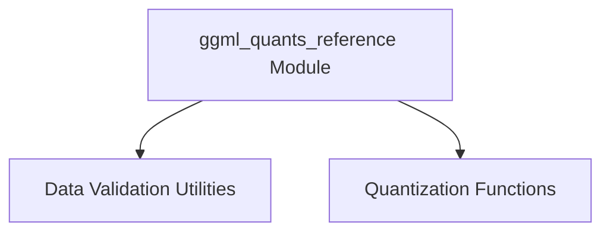

# ggml_quants_reference Module Documentation

## Introduction and Purpose

The `ggml_quants_reference` module provides reference implementations for various integer quantization (IQ) schemes used within the GGML library, alongside utilities for validating the integrity of quantized row data. Its primary purpose is to offer foundational quantization functions and ensure data correctness, serving as a critical component for efficient model inference with reduced precision.

## Architecture Overview

The `ggml_quants_reference` module is logically divided into two main sub-modules: `data_validation` and `quantization_functions`. Both sub-modules contribute to the overall goal of handling and verifying quantized data within the GGML ecosystem.

<!-- DIAGRAM_JSON
{
    "direction": "TD",
    "nodes": [
        {"id": "data_validation", "label": "Data Validation Utilities", "type": "module", "link": "data_validation.md"},
        {"id": "quantization_functions", "label": "Quantization Functions", "type": "module", "link": "quantization_functions.md"}
    ],
    "edges": [
        {"source": "ggml_quants_reference", "target": "data_validation"},
        {"source": "ggml_quants_reference", "target": "quantization_functions"}
    ],
    "groups": []
}
-->

## High-Level Functionality

### [Data Validation Utilities](data_validation.md)
This sub-module is responsible for verifying the integrity of different GGML data types. It includes functions like `ggml_validate_row_data`, which checks for common data issues such as `NaNs` and infinities in floating-point and quantized data rows.

### [Quantization Functions](quantization_functions.md)
This sub-module contains reference implementations for quantizing single-precision floating-point data into various integer quantization formats. It supports different IQ types such as IQ2, IQ3, and IQ4, providing core functionalities for reducing model precision for efficient computation.
