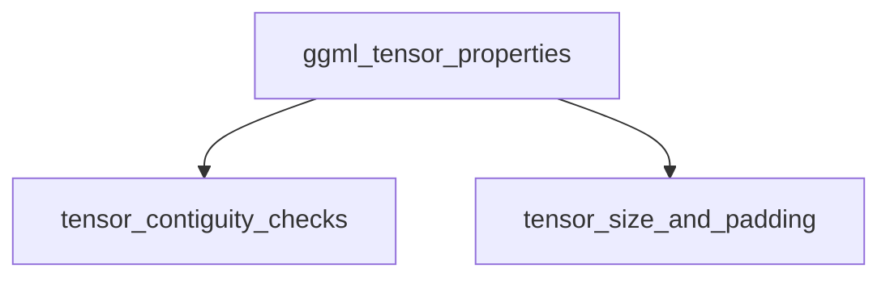

# `ggml_tensor_properties` Module Overview

## Purpose of the Module

The `ggml_tensor_properties` module is a fundamental component within the GGML core library, dedicated to managing and querying the intrinsic memory layout and sizing characteristics of `ggml_tensor` objects. Its primary purpose is to provide essential utilities that ensure efficient memory access, correct data handling, and optimized tensor operations by offering functions to verify tensor contiguity, calculate memory requirements, and determine specific layout properties crucial for various computational graphs and backend implementations.

## Architecture Overview

The `ggml_tensor_properties` module is logically structured into two main sub-modules: `tensor_contiguity_checks` and `tensor_size_and_padding`. These sub-modules encapsulate related functionalities, providing a clear separation of concerns for managing tensor memory attributes.

## Core Components Documentation

The `ggml_tensor_properties` module exposes several core functions that allow for detailed inspection and calculation of tensor memory characteristics:

*   [`ggml_is_contiguously_allocated`](ggml_is_contiguously_allocated.md): Checks if a tensor's entire memory block is contiguously allocated.
*   [`ggml_nbytes_pad`](ggml_nbytes_pad.md): Calculates the padded number of bytes required for a tensor.
*   [`ggml_is_contiguous_1`](ggml_is_contiguous_1.md): Determines if a tensor is contiguous along its first dimension.
*   [`ggml_is_contiguous_2`](ggml_is_contiguous_2.md): Determines if a tensor is contiguous along its first two dimensions.
*   [`ggml_get_max_tensor_size`](ggml_get_max_tensor_size.md): Retrieves the maximum tensor size that can be allocated within a given context.
*   [`ggml_is_contiguous_rows`](ggml_is_contiguous_rows.md): Checks if a tensor's rows are physically contiguous in memory.
*   [`ggml_can_repeat_rows`](ggml_can_repeat_rows.md): Determines if the dimensions of two tensors allow for row repetition in operations.