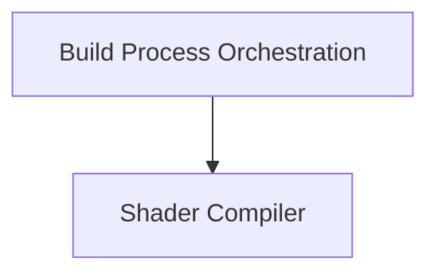

# ggml_vulkan_shader_gen Module Documentation

## Introduction and Purpose

The `ggml_vulkan_shader_gen` module is responsible for generating Vulkan SPIR-V shaders from GLSL source files. It acts as a build tool to compile shaders, manage their output, and integrate them into the `ggml` framework. This module is crucial for enabling Vulkan backend operations within `ggml` by providing the necessary compiled shader binaries.

## Architecture Overview

The module's architecture is centered around a command-line utility that orchestrates the shader compilation process. It parses configuration, invokes an external GLSL compiler (`glslc`), and manages the output of the generated SPIR-V binaries and corresponding C++ header/source files.

<!-- DIAGRAM_JSON
{
    "direction": "TD",
    "nodes": [
        {"id": "build_process", "label": "Build Process Orchestration", "type": "module", "link": "build_process.md"},
        {"id": "shader_compiler", "label": "Shader Compiler", "type": "module", "link": "shader_compiler.md"}
    ],
    "edges": [
        {"source": "build_process", "target": "shader_compiler"}
    ],
    "groups": []
}
-->

## High-Level Functionality

### [Build Process Orchestration](build_process.md)
This sub-module manages the overall flow of the shader generation utility. It handles command-line argument parsing, validates and creates output directories, and coordinates the invocation of the shader compilation for various GLSL files.

### [Shader Compiler](shader_compiler.md)
This sub-module encapsulates the core logic for compiling individual GLSL shader files into SPIR-V binaries. It interfaces with the `glslc` compiler, applies necessary compilation flags and optimizations, and handles error reporting during the compilation process.