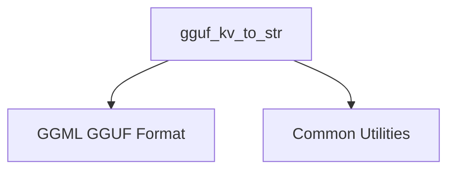

# GGUF Data Conversion Module

## Introduction

The `gguf_data_conversion` module is a specialized utility within the `llama_cpp_mtmd_clip` framework, specifically designed for converting GGUF (GGML Universal Format) key-value data into human-readable string representations. This module plays a crucial role in debugging, logging, and inspection of GGUF model metadata by providing a standardized way to serialize complex GGUF data types, including nested arrays and strings, into a single string.

## Core Functionality

The primary function of this module is `gguf_kv_to_str`, which intelligently processes GGUF key-value pairs. It identifies the type of GGUF value (e.g., string, array, integer, float) and converts it into an appropriate string format. A key feature is its robust handling of GGUF arrays, where it iterates through array elements, converting each to its string representation and correctly formatting the entire array. For string values within arrays, it includes necessary escape sequences for special characters like double quotes and backslashes to maintain valid string literal formatting.

### `gguf_kv_to_str`

```cpp
static std::string gguf_kv_to_str(const struct gguf_context * ctx_gguf, int i) {
    const enum gguf_type type = gguf_get_kv_type(ctx_gguf, i);

    switch (type) {
        case GGUF_TYPE_STRING:
            return gguf_get_val_str(ctx_gguf, i);
        case GGUF_TYPE_ARRAY:
            {
                const enum gguf_type arr_type = gguf_get_arr_type(ctx_gguf, i);
                int arr_n = gguf_get_arr_n(ctx_gguf, i);
                const void * data = arr_type == GGUF_TYPE_STRING ? nullptr : gguf_get_arr_data(ctx_gguf, i);
                std::stringstream ss;
                ss << "[";
                for (int j = 0; j < arr_n; j++) {
                    if (arr_type == GGUF_TYPE_STRING) {
                        std::string val = gguf_get_arr_str(ctx_gguf, i, j);
                        // escape quotes
                        string_replace_all(val, "\\", "\\\\");
                        string_replace_all(val, "\"", "\\\\"");
                        ss << '"' << val << '"'";
                    } else if (arr_type == GGUF_TYPE_ARRAY) {
                        ss << "???";
                    } else {
                        ss << gguf_data_to_str(arr_type, data, j);
                    }
                    if (j < arr_n - 1) {
                        ss << ", ";
                    }
                }
                ss << "]";
                return ss.str();
            }
        default:
            return gguf_data_to_str(type, gguf_get_val_data(ctx_gguf, i), 0);
    }
}
```

This function takes a GGUF context and an index, then retrieves the key-value pair at that index. It handles the conversion based on the GGUF type:

*   **`GGUF_TYPE_STRING`**: Directly retrieves and returns the string value.
*   **`GGUF_TYPE_ARRAY`**: Iterates through the array elements. For string arrays, it escapes quotes and backslashes within each string. For other array types, it uses `gguf_data_to_str` for conversion. Nested arrays are currently represented as "???".
*   **Other types**: Delegates the conversion to `gguf_data_to_str`.

## Architecture and Component Relationships

The `gguf_data_conversion` module is a leaf module residing within the `llama_cpp_mtmd_clip.clip_implementation_details` hierarchy. Its core function, `gguf_kv_to_str`, relies on several external components to perform its data conversion tasks.

<!-- DIAGRAM_JSON
{
    "direction": "TD",
    "nodes": [
        {"id": "gguf_kv_to_str", "label": "gguf_kv_to_str", "type": "component", "link": null},
        {"id": "ggml_gguf_format", "label": "GGML GGUF Format", "type": "external", "link": "ggml_gguf_format.md"},
        {"id": "common_utils", "label": "Common Utilities", "type": "external", "link": "common_utils.md"}
    ],
    "edges": [
        {"source": "gguf_kv_to_str", "target": "ggml_gguf_format"},
        {"source": "gguf_kv_to_str", "target": "common_utils"}
    ],
    "groups": []
}
-->


### Dependencies:

*   **[ggml_gguf_format](ggml_gguf_format.md)**: This module provides the core GGUF API functions, such as `gguf_get_kv_type`, `gguf_get_val_str`, `gguf_get_arr_type`, `gguf_get_arr_n`, `gguf_get_arr_data`, `gguf_get_arr_str`, and `gguf_data_to_str`. These functions are essential for `gguf_kv_to_str` to inspect and extract data from the `gguf_context`.
*   **[common_utils](common_utils.md)**: Specifically, the `string_replace_all` utility function is used for escaping special characters within string values when they are part of a GGUF array. This ensures that the generated string representation is correctly formatted and parseable.

## Integration with the Overall System

This `gguf_data_conversion` module serves as a low-level utility, primarily supporting the `llama_cpp_mtmd_clip` module by facilitating the introspection and serialization of GGUF model metadata. While it doesn't directly expose a user-facing API, its functionality is critical for internal processes that require string representations of GGUF key-value pairs, such as debugging, logging, or potentially displaying model information in a human-readable format. Its position within the `clip_implementation_details` suggests its role in the internal workings of the CLIP implementation, likely aiding in the handling and verification of GGUF model assets used by the CLIP components.
