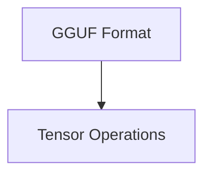

# GGUF Tensor Management

## Introduction
The `gguf_tensor_management` module is a core component within the `ggml` ecosystem, specifically designed to handle the manipulation and management of tensors within the GGUF (GGML Universal File Format) context. This module provides essential functionalities for adding new tensors, modifying their data types, and assigning actual data to them, ensuring efficient and structured storage and retrieval of model parameters in the GGUF format.

## Architecture
The `gguf_tensor_management` module is a part of the `ggml_gguf_format` module. It primarily interacts with the `gguf_context` to perform tensor-related operations.

<!-- DIAGRAM_JSON
{
    "direction": "TD",
    "nodes": [
        {"id": "gguf_gguf_format", "label": "GGUF Format", "type": "module", "link": "gguf_gguf_format.md"},
        {"id": "tensor_operations", "label": "Tensor Operations", "type": "module", "link": "tensor_operations.md"}
    ],
    "edges": [
        {"source": "gguf_gguf_format", "target": "tensor_operations"}
    ],
    "groups": []
}
-->

## Sub-modules

### [Tensor Operations](tensor_operations.md)
This sub-module focuses on the fundamental operations for managing tensors within the GGUF context. It includes functions to add new tensors, set their data types, and assign their raw data, ensuring proper structuring and handling of tensor information.
