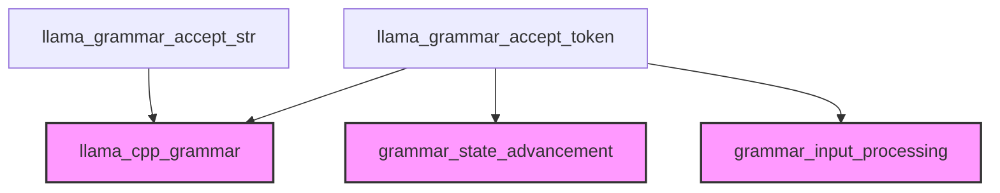

# Module: grammar_acceptance

## Introduction

The `grammar_acceptance` module is a crucial component within the `llama.cpp` grammar processing system, specifically responsible for advancing the grammar state based on input strings and individual tokens. It ensures that generated or parsed text adheres to the defined grammar rules by verifying and updating the grammar's internal state with each accepted piece of input. This module forms the bedrock for constrained text generation and robust grammar-guided parsing.

## Architecture and Component Relationships

The `grammar_acceptance` module is a leaf module nestled within the `grammar_input_processing` sub-module, which itself is part of the `grammar_state_advancement` and ultimately the `llama_cpp_grammar` module. Its core functionality revolves around two primary components: `llama_grammar_accept_str` and `llama_grammar_accept_token`.

### Core Components

-   **`llama_grammar_accept_str`**: This function processes an entire string (`piece`) against the current grammar state. It decodes the UTF-8 string into individual code points and iteratively calls `llama_grammar_accept` for each code point. This allows the grammar to evolve character by character, ensuring that the entire string conforms to the grammar rules. It also handles partial UTF-8 sequences for continuous input.

-   **`llama_grammar_accept_token`**: This function is designed to accept a `llama_token` along with its string representation (`piece`). It's more sophisticated than `llama_grammar_accept_str` as it considers the token type and uses specific grammar matching logic (`llama_grammar_match_token`). For token types that are not direct terminal tokens, it further breaks down the token's string `piece` into code points and uses `llama_grammar_accept_chr` to process them against the grammar. This component manages multiple grammar stacks, advancing them based on accepted tokens and characters.

### Dependencies

The `grammar_acceptance` module relies on several external functions and structures to perform its operations:

-   **`llama_grammar` struct**: The central data structure representing the current state of the grammar, including its rules and internal stacks. This struct is managed by the [llama_cpp_grammar](llama_cpp_grammar.md) module.
-   **`decode_utf8`**: A utility function (likely from a `string_manipulation` or `common_utils` module) used to convert input strings into UTF-8 code points, handling potential partial sequences.
-   **`llama_grammar_accept`**: A function (likely from [llama_cpp_grammar](llama_cpp_grammar.md) or [grammar_state_advancement](grammar_state_advancement.md)) that processes a single code point against the grammar.
-   **`llama_grammar_match_token`**: A function (likely from [llama_cpp_grammar](llama_cpp_grammar.md)) that determines if a given token matches a grammar element.
-   **`llama_grammar_is_end_of_sequence`**: A utility function (likely from [llama_cpp_grammar](llama_cpp_grammar.md)) to check if a grammar sequence has reached its end.
-   **`llama_grammar_advance_stack`**: A crucial function from [grammar_state_advancement](grammar_state_advancement.md) that updates and prunes the grammar stacks based on accepted elements.
-   **`llama_grammar_accept_chr`**: A function from [grammar_input_processing](grammar_input_processing.md) that processes a single character against a given grammar stack.

<!-- DIAGRAM_JSON
{
    "direction": "TD",
    "nodes": [
        {"id": "llama_grammar_accept_str", "label": "llama_grammar_accept_str", "type": "component", "link": null},
        {"id": "llama_grammar_accept_token", "label": "llama_grammar_accept_token", "type": "component", "link": null},
        {"id": "grammar_input_processing", "label": "grammar_input_processing", "type": "external", "link": "grammar_input_processing.md"},
        {"id": "grammar_state_advancement", "label": "grammar_state_advancement", "type": "external", "link": "grammar_state_advancement.md"},
        {"id": "llama_cpp_grammar", "label": "llama_cpp_grammar", "type": "external", "link": "llama_cpp_grammar.md"}
    ],
    "edges": [
        {"source": "llama_grammar_accept_str", "target": "llama_cpp_grammar"},
        {"source": "llama_grammar_accept_token", "target": "llama_cpp_grammar"},
        {"source": "llama_grammar_accept_token", "target": "grammar_state_advancement"},
        {"source": "llama_grammar_accept_token", "target": "grammar_input_processing"}
    ],
    "groups": []
}
-->

## How the Module Fits into the Overall System

The `grammar_acceptance` module is a low-level, but critical, part of the `llama.cpp`'s grammar enforcement mechanism. It acts as the direct interface for validating and applying incoming text (either as raw strings or pre-tokenized inputs) against a loaded grammar.

Its placement within `grammar_input_processing` and `grammar_state_advancement` highlights its role in the sequential processing of input and the dynamic evolution of the grammar's possible states. When a language model generates a token, or when external text is being parsed, functions in this module are called to update the grammar's internal stacks. This ensures that only valid continuations according to the grammar are allowed, effectively guiding the text generation or validating the parsed input.

In a generation scenario, after a token is generated, `llama_grammar_accept_token` is called to prune the possible next tokens based on the grammar. In a parsing scenario, it validates if the input sequence adheres to the defined grammar. Without `grammar_acceptance`, the grammar system would not be able to dynamically adjust its state based on received input, making grammar-guided generation or parsing impossible.