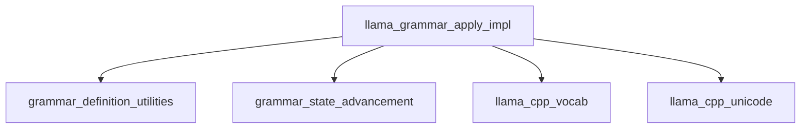

# Module: `grammar_application`

## Introduction
The `grammar_application` module is a crucial component within the `llama_cpp_grammar` system, responsible for enforcing grammatical constraints during the token generation process. Its primary function is to filter and adjust the probabilities (logits) of candidate tokens based on a predefined grammar, ensuring that the generated text adheres to specified structural and syntactical rules. This module prevents the generation of grammatically incorrect or non-compliant token sequences, making it essential for tasks requiring structured outputs, such as JSON generation or adherence to specific language formats.

## Comprehensive Documentation

### Purpose and Core Functionality
The core functionality of the `grammar_application` module is encapsulated in the `llama_grammar_apply_impl` function. This function takes a set of candidate tokens (`llama_token_data_array`) and a grammar definition (`llama_grammar`) as input. It then iterates through each token, assesses its compliance with the current grammar state, and modifies its logit (probability score). Tokens that violate the grammar rules have their logits set to negative infinity, effectively preventing them from being selected during the sampling process.

Key operations performed by `llama_grammar_apply_impl`:
*   **Grammar Trigger Check**: Immediately exits if the grammar is in an `awaiting_trigger` state, indicating that no grammar application is currently needed.
*   **End-of-Grammar (EOG) Handling**: Determines if an End-of-Grammar token is allowed based on the current grammar stack. If an EOG token appears when not permitted by the grammar, its logit is suppressed.
*   **Token Piece Extraction and Validation**: Converts token IDs into their string representations (pieces) using the provided vocabulary. It also checks for empty or null pieces, suppressing their logits if found.
*   **UTF-8 Decoding**: Decodes UTF-8 encoded token pieces to facilitate grammar matching.
*   **Candidate Rejection**: Utilizes the grammar's rules and current state to identify and reject tokens that do not conform to the grammar. This is performed by `llama_grammar_reject_candidates`.
*   **Logit Modification**: Sets the logits of rejected or invalid tokens to negative infinity, effectively pruning them from the sampling pool.

### Architecture and Component Relationships

The `grammar_application` module's architecture centers around the `llama_grammar_apply_impl` function, which orchestrates the grammar enforcement process. It interacts with several other modules and internal components to perform its duties.

<!-- DIAGRAM_JSON
{
    "direction": "TD",
    "nodes": [
        {"id": "llama_grammar_apply_impl", "label": "llama_grammar_apply_impl", "type": "component", "link": null},
        {"id": "grammar_definition_utilities", "label": "grammar_definition_utilities", "type": "external", "link": "grammar_definition_utilities.md"},
        {"id": "grammar_state_advancement", "label": "grammar_state_advancement", "type": "external", "link": "grammar_state_advancement.md"},
        {"id": "llama_cpp_vocab", "label": "llama_cpp_vocab", "type": "external", "link": "llama_cpp_vocab.md"},
        {"id": "llama_cpp_unicode", "label": "llama_cpp_unicode", "type": "external", "link": "llama_cpp_unicode.md"}
    ],
    "edges": [
        {"source": "llama_grammar_apply_impl", "target": "grammar_definition_utilities"},
        {"source": "llama_grammar_apply_impl", "target": "grammar_state_advancement"},
        {"source": "llama_grammar_apply_impl", "target": "llama_cpp_vocab"},
        {"source": "llama_grammar_apply_impl", "target": "llama_cpp_unicode"}
    ],
    "groups": []
}
-->

**Component Relationships:**
*   **`llama_grammar_apply_impl`**: The central function of this module. It orchestrates the grammar application process.
*   **`grammar_definition_utilities`**: Provides the structural definition of the grammar (`llama_grammar` rules). `llama_grammar_apply_impl` relies on this for understanding the grammar's rules.
*   **`grammar_state_advancement`**: Contains the logic for managing the grammar's state and, critically, the `llama_grammar_reject_candidates` function, which `llama_grammar_apply_impl` calls to filter tokens.
*   **`llama_cpp_vocab`**: Used by `llama_grammar_apply_impl` to convert token IDs into their string representations (`token_to_piece`) and to identify End-of-Grammar (EOG) tokens (`is_eog`).
*   **`llama_cpp_unicode`**: Likely contains utilities like `decode_utf8`, which is used by `llama_grammar_apply_impl` to process token pieces that may contain multi-byte UTF-8 characters.

### How the Module Fits into the Overall System

The `grammar_application` module is an integral part of the `llama_cpp_grammar` system, which itself is a sub-module of `llama_cpp_common`. It operates downstream from the token sampling process and upstream from final token selection.

1.  **Grammar Definition**: The grammar rules are initially defined and managed by modules like `json_schema_grammar` and `grammar_definition_utilities`.
2.  **Token Generation**: The main model (part of `llama_cpp_impl` and `llama_cpp_context`) generates a set of candidate tokens and their associated logits.
3.  **Grammar Application**: The `grammar_application` module, specifically `llama_grammar_apply_impl`, takes these candidate tokens. It consults the grammar definition and the current grammar state (maintained by `grammar_state_advancement`) to filter out invalid tokens.
4.  **Token Selection**: After the grammar application, the logits of non-compliant tokens are suppressed, ensuring that subsequent sampling steps select only grammatically valid tokens. This guided generation is critical for tasks where output format or structure is important.

By integrating seamlessly with the vocabulary and grammar state management, `grammar_application` enables sophisticated control over the model's output, allowing it to generate text that adheres to complex formal grammars or specific structural requirements.
