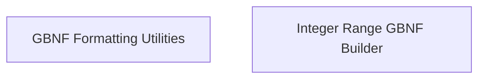

# Grammar Building Utilities

## Introduction

The `grammar_building_utilities` module, a sub-component of `json_schema_grammar` within `llama_cpp_common`, is designed to facilitate the conversion of JSON schema definitions into GBNF (Grammar-based Neural Format) grammar rules. It provides essential utilities for formatting literal values and constructing complex grammar rules for integer ranges, which are crucial for guiding language models to generate structured output conforming to a specified schema.

## Architecture

This module is structured into the following sub-modules, each addressing a specific aspect of GBNF grammar construction:

- **[GBNF Formatting Utilities](grammar_formatting.md)**: Handles the basic formatting of string literals for use in GBNF rules.
- **[Integer Range GBNF Builder](integer_range_grammar.md)**: Manages the intricate process of generating GBNF rules that accurately represent numerical ranges (min/max integers) from JSON schema specifications.

<!-- DIAGRAM_JSON
{
    "direction": "TD",
    "nodes": [
        {"id": "grammar_formatting", "label": "GBNF Formatting Utilities", "type": "module", "link": "grammar_formatting.md"},
        {"id": "integer_range_grammar", "label": "Integer Range GBNF Builder", "type": "module", "link": "integer_range_grammar.md"}
    ],
    "edges": [],
    "groups": []
}
-->

