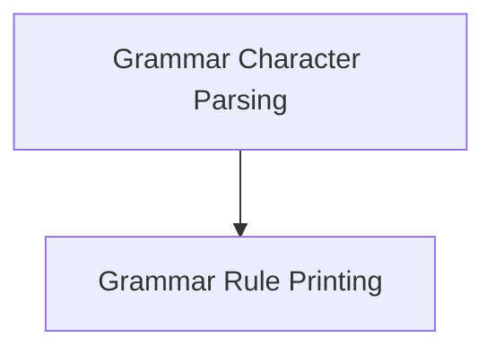

# Grammar Definition Utilities Module

## Introduction

The `grammar_definition_utilities` module provides essential functionalities for parsing and printing grammar rules within the `llama.cpp` project. It handles the intricate details of converting character sequences into their respective grammar elements and formatting grammar rules for output.

## Architecture Overview

This module is composed of two primary sub-modules:
- `grammar_parsing`: Responsible for character parsing, including escape sequences and UTF-8 handling.
- `grammar_printing`: Manages the structured output of grammar rules to a file.

These sub-modules work in tandem to ensure robust grammar definition and representation.

<!-- DIAGRAM_JSON
{
    "direction": "TD",
    "nodes": [
        {"id": "grammar_parsing", "label": "Grammar Character Parsing", "type": "module", "link": "grammar_parsing.md"},
        {"id": "grammar_printing", "label": "Grammar Rule Printing", "type": "module", "link": "grammar_printing.md"}
    ],
    "edges": [
        {"source": "grammar_parsing", "target": "grammar_printing"}
    ],
    "groups": []
}
-->

## Sub-modules

### [Grammar Character Parsing](grammar_parsing.md)
This sub-module focuses on the low-level parsing of individual characters that form part of grammar definitions. It supports handling of various escape sequences and proper decoding of UTF-8 characters to ensure correct interpretation of grammar source.

### [Grammar Rule Printing](grammar_printing.md)
This sub-module is responsible for taking structured grammar rules and rendering them into a human-readable format, typically for file output. It correctly formats different types of grammar elements, such as rule references, character ranges, and tokens, ensuring the output accurately represents the defined grammar.