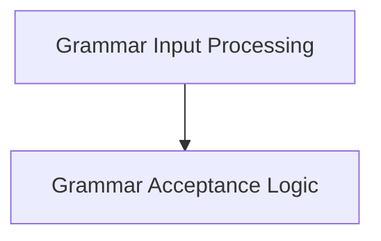

# Grammar Input Processing Module

## Introduction
The `grammar_input_processing` module is a critical component within the `llama_cpp_grammar` system, specifically under `grammar_state_advancement`. Its primary role is to process input strings and tokens, validating them against the current grammar state and advancing that state accordingly. This ensures that generated or parsed output adheres to the defined grammatical rules.

## Architecture Overview
The `grammar_input_processing` module's architecture is straightforward, focusing on efficient and accurate grammar state management. It primarily relies on the `grammar_acceptance` sub-module to handle the core logic of consuming input.

<!-- DIAGRAM_JSON
{
    "direction": "TD",
    "nodes": [
        {"id": "grammar_input_processing", "label": "Grammar Input Processing", "type": "module"},
        {"id": "grammar_acceptance", "label": "Grammar Acceptance Logic", "type": "module", "link": "grammar_acceptance.md"}
    ],
    "edges": [
        {"source": "grammar_input_processing", "target": "grammar_acceptance"}
    ],
    "groups": []
}
-->

## Sub-modules:

### [Grammar Acceptance Logic](grammar_acceptance.md)
This sub-module encapsulates the core functions (`llama_grammar_accept_str` and `llama_grammar_accept_token`) responsible for validating and processing incoming string pieces and tokens against the current grammar rules. It manages the grammar stack and partial UTF-8 sequences to maintain a consistent state.
