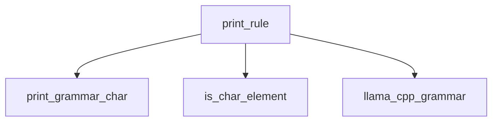

# Module: `grammar_printing`

### Introduction
The `grammar_printing` module is a vital part of the `llama_cpp_grammar` component within the `llama.cpp` project. Its primary function is to convert internal representations of grammar rules into a human-readable string format, typically for debugging, logging, or visualization purposes.

### Purpose and Core Functionality
The `grammar_printing` module is designed to provide a clear and concise textual representation of the grammar rules used by the `llama.cpp` inference engine. Its core functionality is encapsulated in the `print_rule` function, which takes a grammar rule object and a mapping of symbol IDs to names, then outputs the rule definition to a specified file stream.

The `print_rule` function performs the following key operations:
1.  **Rule Validation**: It first validates the input `llama_grammar_rule` to ensure it is well-formed and terminates correctly with an `LLAMA_GRETYPE_END` element. Malformed rules trigger a runtime error.
2.  **Symbol Name Resolution**: It uses the `symbol_id_names` map to translate numerical rule IDs and symbol references into their human-readable string equivalents, making the output more understandable.
3.  **Element-wise Printing**: It iterates through each `llama_grammar_element` in the rule, processing different grammar element types (e.g., alternatives, rule references, character literals, character ranges, tokens, etc.) and formatting them according to standard grammar notation.
4.  **Character Handling**: For character-related elements (`LLAMA_GRETYPE_CHAR`, `LLAMA_GRETYPE_CHAR_NOT`, `LLAMA_GRETYPE_CHAR_RNG_UPPER`, `LLAMA_GRETYPE_CHAR_ALT`, `LLAMA_GRETYPE_CHAR_ANY`), it utilizes a helper function `print_grammar_char` to correctly represent character values and manages the opening and closing of character sets (e.g., `[]`).
5.  **Token Representation**: It specifically formats token references (`LLAMA_GRETYPE_TOKEN`, `LLAMA_GRETYPE_TOKEN_NOT`) to clearly distinguish them.

This module is crucial for developers and maintainers to inspect and verify the grammar rules being used, aiding in debugging grammar definitions and understanding their structure.

### Architecture and Component Relationships

The `grammar_printing` module is a leaf module under `grammar_definition_utilities` within the `llama_cpp_grammar` module.

The main component is `print_rule`. It interacts with internal helper functions like `print_grammar_char` and `is_char_element` for detailed formatting of grammar elements.

This module primarily depends on the core grammar definition structures provided by the overall [llama_cpp_grammar](llama_cpp_grammar.md) module, specifically the `llama_grammar_rule` and `llama_grammar_element` types. It also relies on external context to provide the `symbol_id_names` mapping.

<!-- DIAGRAM_JSON
{
    "direction": "TD",
    "nodes": [
        {"id": "print_rule", "label": "print_rule", "type": "component", "link": null},
        {"id": "print_grammar_char", "label": "print_grammar_char", "type": "component", "link": null},
        {"id": "is_char_element", "label": "is_char_element", "type": "component", "link": null},
        {"id": "llama_cpp_grammar", "label": "llama_cpp_grammar", "type": "external", "link": "llama_cpp_grammar.md"}
    ],
    "edges": [
        {"source": "print_rule", "target": "print_grammar_char"},
        {"source": "print_rule", "target": "is_char_element"},
        {"source": "print_rule", "target": "llama_cpp_grammar"}
    ],
    "groups": []
}
-->

### How the Module Fits into the Overall System

The `grammar_printing` module plays a supporting role within the broader `llama_cpp_grammar` system. While not directly involved in the parsing or application of grammars during inference, it is essential for:

*   **Debugging**: Providing a human-readable output of generated or loaded grammars, which is invaluable for debugging complex grammar definitions.
*   **Verification**: Allowing developers to verify that the internal grammar representation accurately reflects the intended grammar rules.
*   **Tooling**: Potentially serving as a backend for tools that visualize or export grammar definitions.

It takes the raw, internal `llama_grammar_rule` data structures (which are defined and managed by the parent `llama_cpp_grammar` module) and formats them into a standard EBNF-like syntax, thus bridging the gap between machine-interpretable grammar and human understanding.
