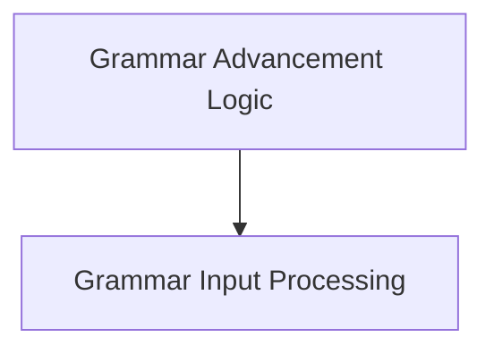

# `grammar_state_advancement` Module Documentation

## Introduction
The `grammar_state_advancement` module is responsible for managing and updating the state of a `llama_grammar` instance based on incoming text or tokens. It ensures that the grammar accurately reflects the parsed input, handling complexities like UTF-8 decoding and trigger patterns. This module is critical for enforcing grammar constraints during text generation.

## Architecture Overview
The `grammar_state_advancement` module is structured into two main sub-modules: `grammar_advancement_logic` and `grammar_input_processing`. The `grammar_advancement_logic` acts as the primary orchestrator, handling high-level concerns like trigger patterns and dispatching input to the `grammar_input_processing` sub-module, which deals with the direct application of strings and tokens to the grammar state.

## Sub-modules

*   **Grammar Advancement Logic** ([`grammar_advancement_logic.md`](grammar_advancement_logic.md))
    This sub-module contains the core logic for advancing the grammar state, including the handling of trigger tokens and regex patterns that can dynamically alter grammar behavior. It dispatches the actual token and string processing to the `grammar_input_processing` sub-module.

*   **Grammar Input Processing** ([`grammar_input_processing.md`](grammar_input_processing.md))
    This sub-module is responsible for the direct application of decoded strings and individual tokens to the grammar's internal state. It manages the grammar stack updates and UTF-8 partial sequences.

## Architecture Diagram

<!-- DIAGRAM_JSON
{
    "direction": "TD",
    "nodes": [
        {"id": "grammar_advancement_logic", "label": "Grammar Advancement Logic", "type": "module", "link": "grammar_advancement_logic.md"},
        {"id": "grammar_input_processing", "label": "Grammar Input Processing", "type": "module", "link": "grammar_input_processing.md"}
    ],
    "edges": [
        {"source": "grammar_advancement_logic", "target": "grammar_input_processing"}
    ],
    "groups": []
}
-->

