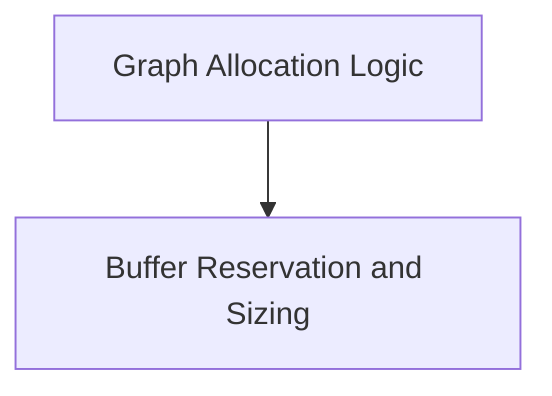

# Graph Allocation Module

## Introduction
The `graph_allocation` module is a critical component within the GGML library, responsible for efficient memory management during the execution of computation graphs. It provides functionalities for allocating memory for graph tensors and reserving buffer sizes to optimize performance and resource utilization. This module is essential for the backend operations, ensuring that the necessary memory is available and correctly managed for tensor computations.

## Architecture
The `graph_allocation` module is structured into the following key sub-modules:

<!-- DIAGRAM_JSON
{
    "direction": "TD",
    "nodes": [
        {"id": "graph_allocation_logic", "label": "Graph Allocation Logic", "type": "module", "link": "graph_allocation_logic.md"},
        {"id": "buffer_reservation_and_sizing", "label": "Buffer Reservation and Sizing", "type": "module", "link": "buffer_reservation_and_sizing.md"}
    ],
    "edges": [
        {"source": "graph_allocation_logic", "target": "buffer_reservation_and_sizing", "label": "Reserves for"}
    ],
    "groups": []
}
-->

## Sub-modules Overview

### [Graph Allocation Logic](graph_allocation_logic.md)
This sub-module focuses on the core logic for allocating memory for tensors within a computation graph. It handles dynamic reallocation when necessary and ensures all graph nodes and leaf tensors are correctly initialized with their assigned memory buffers.

### [Buffer Reservation and Sizing](buffer_reservation_and_sizing.md)
This sub-module is responsible for reserving memory space across multiple buffers for a given computation graph. It also calculates and reports the maximum required sizes for these buffers, aiding in proactive memory management before actual allocation.
