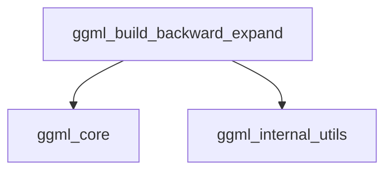

# `graph_construction` Module Documentation

The `graph_construction` module is a critical component within the `ggml_graph_management` submodule, itself residing within the broader `ggml_core` framework. Its primary responsibility is to facilitate the construction of the backward pass of a computation graph, enabling automatic differentiation and gradient accumulation for training machine learning models.

### Purpose and Core Functionality

The `graph_construction` module's core functionality is encapsulated in the `ggml_build_backward_expand` function. This function takes a forward computation graph (`ggml_cgraph`) and prepares it for backpropagation. It identifies all trainable parameters and loss nodes, determines which tensors require gradients, allocates necessary gradient accumulators, and then orchestrates the calls to `ggml_compute_backward` to build the complete backward graph.

Key aspects of its functionality include:

1.  **Gradient Requirement Analysis**: It iterates through the forward graph to identify tensors marked as parameters (`GGML_TENSOR_FLAG_PARAM`) or loss (`GGML_TENSOR_FLAG_LOSS`), which are essential for gradient computation.
2.  **Ignored Gradients**: It intelligently skips gradient computation for specific operations or sources that do not contribute to the overall gradient, such as indices in `GGML_OP_GET_ROWS` or constant parts of `GGML_OP_SGN` and `GGML_OP_STEP` unary operations.
3.  **Gradient Accumulator Management**: It ensures the presence of a gradient accumulator for tensors requiring gradients. If pre-allocated accumulators (`grad_accs`) are provided, they are used; otherwise, new `F32` tensors are allocated, especially for loss nodes.
4.  **Backward Graph Construction**: It iterates the forward graph in reverse order, calling `ggml_compute_backward` for each node that needs its gradients computed, effectively building the backpropagation path.

### Architecture and Component Relationships

The `graph_construction` module contains a single core component, `ggml_build_backward_expand`. This function interacts heavily with fundamental GGML data structures and core operations.

<!-- DIAGRAM_JSON
{
    "direction": "TD",
    "nodes": [
        {"id": "ggml_build_backward_expand_func", "label": "ggml_build_backward_expand", "type": "component", "link": null},
        {"id": "ggml_core_module", "label": "ggml_core", "type": "external", "link": "ggml_core.md"},
        {"id": "ggml_internal_utils_module", "label": "ggml_internal_utils", "type": "external", "link": "ggml_internal_utils.md"}
    ],
    "edges": [
        {"source": "ggml_build_backward_expand_func", "target": "ggml_core_module"},
        {"source": "ggml_build_backward_expand_func", "target": "ggml_internal_utils_module"}
    ],
    "groups": []
}
-->

**Internal Components:**

*   `ggml_build_backward_expand`: The central function of this module, responsible for constructing the backward pass graph.

**External Dependencies:**

*   **[ggml_core](ggml_core.md)**: Provides core functionalities and data structures such as:
    *   `struct ggml_context`: The main GGML context for memory and resource management.
    *   `struct ggml_tensor`: The fundamental data type representing tensors in the computation graph.
    *   `ggml_new_tensor`: For allocating new tensors, particularly for gradient accumulators.
    *   `ggml_compute_backward`: The underlying function called to compute gradients for individual nodes.
    *   `ggml_get_unary_op`: Used to identify the specific type of unary operation for gradient handling.
*   **[ggml_internal_utils](ggml_internal_utils.md)**: Provides utility functions for internal data structures:
    *   `ggml_hash_find`: Used for efficient lookup within hash sets, particularly for `cgraph->visited_hash_set`.
    *   `ggml_bitset_get`: For checking flags in bitsets, also related to graph traversal and state.

The `ggml_build_backward_expand` function operates on a `ggml_cgraph` structure, which represents the computation graph. While `ggml_cgraph` is a core concept manipulated by this module, its definition and management are part of the broader [ggml_graph_management](ggml_graph_management.md) and [ggml_core](ggml_core.md) modules.

### How the Module Fits into the Overall System

The `graph_construction` module is an integral part of the GGML library's automatic differentiation capabilities. It sits within the [ggml_graph_management](ggml_graph_management.md) module, which is responsible for defining, manipulating, and executing computation graphs.

Its role is crucial for any training workload, as it provides the mechanism to transform a forward pass computation into a backward pass suitable for gradient calculation. This allows higher-level modules, such as optimizers (e.g., [ggml_optimizer](ggml_optimizer.md)), to effectively update model parameters based on the computed gradients, thereby enabling model training. Without this module, the GGML backend would lack the ability to perform backpropagation and, consequently, training. It acts as a bridge between the definition of a computational process and its differentiable counterpart.