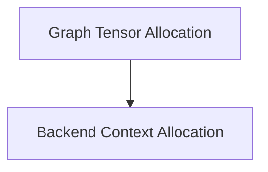

# Graph Context Allocation Module

## Introduction
The `graph_context_allocation` module is a critical component within the GGML backend allocator, responsible for efficient memory management of tensors within computational graphs and GGML contexts. It provides functionalities for reserving, allocating, and querying memory requirements for both graph-specific operations and backend-driven context allocations.

## Architecture Overview
This module is structured into two main sub-modules:
- **Graph Tensor Allocation**: Focuses on managing the memory allocation for individual computational graphs, including their leaf and node tensors.
- **Backend Context Allocation**: Deals with higher-level memory allocation for entire GGML contexts, leveraging specific backend buffer types.

These sub-modules interact by providing distinct but complementary allocation strategies, ensuring optimal memory utilization depending on whether the allocation is graph-centric or context-centric.

<!-- DIAGRAM_JSON
{
    "direction": "TD",
    "nodes": [
        {"id": "graph_allocation", "label": "Graph Tensor Allocation", "type": "module", "link": "graph_allocation.md"},
        {"id": "backend_context_allocation", "label": "Backend Context Allocation", "type": "module", "link": "backend_context_allocation.md"}
    ],
    "edges": [
        {"source": "graph_allocation", "target": "backend_context_allocation", "label": "supports"}
    ],
    "groups": []
}
-->

## Sub-modules

### [Graph Tensor Allocation](graph_allocation.md)
This sub-module is responsible for the precise allocation and reservation of memory for tensors involved in GGML computational graphs. It includes functions for allocating graph tensors, handling reallocations, and determining the required memory sizes.

### [Backend Context Allocation](backend_context_allocation.md)
This sub-module provides functionalities for allocating memory for all tensors within a given GGML context, typically leveraging a specific backend's buffer type. It also offers methods to query the total memory size required for such allocations without performing the actual allocation.