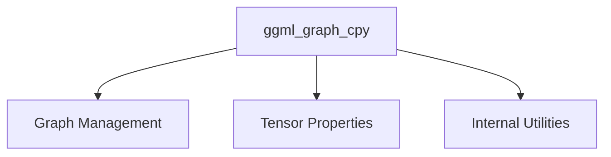

# Module: `graph_copy_operations`

## Introduction
The `graph_copy_operations` module provides the core functionality for deep copying computational graphs within the GGML library. This is a critical operation for various graph manipulation tasks, such as creating graph snapshots, duplicating graphs for optimization, or managing graph state.

## Core Functionality

The primary function in this module is `ggml_graph_cpy`, which facilitates the duplication of a `ggml_cgraph` structure. This function ensures that all relevant aspects of the source graph, including its leaf nodes, computational nodes, and hash set information (used for tracking tensors), are accurately transferred to the destination graph. It also handles the copying of gradient information if present in the source graph.

## Architecture and Component Relationships

The `graph_copy_operations` module centers around the `ggml_graph_cpy` function. This function interacts with several other GGML components to perform its task:

*   **`ggml_cgraph` (from `ggml_graph_management`):** The module directly operates on `ggml_cgraph` structures, which represent the computational graphs in GGML. It copies the internal arrays (`leafs`, `nodes`) and metadata (`n_leafs`, `n_nodes`, `order`) of these structures.
*   **`ggml_tensor` (from `ggml_tensor_properties`):** The `ggml_cgraph` contains references to `ggml_tensor` objects. While `ggml_graph_cpy` copies the pointers to these tensors, it doesn't deep-copy the tensor data itself.
*   **Hash Set Operations (from `ggml_internal_utils`):** The function utilizes hash set utilities (`ggml_bitset_get`, `ggml_hash_insert`, `ggml_hash_find`) to manage the `visited_hash_set` within the `ggml_cgraph`, ensuring that tensor usage counts and gradient associations are correctly preserved in the copied graph.

## `ggml_graph_cpy` Function Details

```c
void ggml_graph_cpy(struct ggml_cgraph * src, struct ggml_cgraph * dst);
```

**Purpose:** Copies the contents of a source computational graph (`src`) to a destination computational graph (`dst`).

**Parameters:**
*   `src`: A pointer to the source `ggml_cgraph` structure to be copied.
*   `dst`: A pointer to the destination `ggml_cgraph` structure where the data will be copied. The `dst` graph must have sufficient pre-allocated capacity (`size`) to accommodate the `src` graph's leafs and nodes.

**Behavior:**
1.  **Assertions:** Verifies that the destination graph has enough capacity for leafs, nodes, and the visited hash set.
2.  **Metadata Copy:** Copies `n_leafs`, `n_nodes`, and `order` from `src` to `dst`.
3.  **Leaf and Node Copy:** Iterates through `src->leafs` and `src->nodes`, copying their contents directly to `dst->leafs` and `dst->nodes`, respectively.
4.  **Hash Set Copy:** Copies the in-use keys (tensors) from `src->visited_hash_set` to `dst->visited_hash_set` using `ggml_hash_insert`, also preserving the `use_counts`.
5.  **Gradient Copy (Optional):** If `src` has gradient information (`src->grads`), it asserts that `dst` also has allocated gradient arrays and then copies the gradient tensors (`grads` and `grad_accs`) for each node from `src` to `dst`, ensuring correct mapping via hash lookups.

**Key Considerations:**
*   This function performs a shallow copy of tensors themselves; only the pointers to `ggml_tensor` objects are copied, not their underlying data.
*   The `dst` graph must be properly initialized with sufficient memory to receive the copied elements.

## How it Fits into the Overall System

The `graph_copy_operations` module is an integral part of the [ggml_core](ggml_core.md) library, specifically nested within its graph management functionalities. It enables the creation of independent copies of computational graphs, which is essential for:
*   **Graph Optimization:** Allowing algorithms to modify a copy of a graph without affecting the original.
*   **Checkpointing and Rollback:** Saving the state of a graph at various points.
*   **Parallel Processing:** Providing distinct graph instances for concurrent operations.

It is a low-level utility that underpins higher-level graph manipulation and execution strategies within GGML.

<!-- DIAGRAM_JSON
{
    "direction": "TD",
    "nodes": [
        {"id": "ggml_graph_cpy", "label": "ggml_graph_cpy", "type": "component", "link": null},
        {"id": "ggml_graph_management", "label": "Graph Management", "type": "external", "link": "ggml_graph_management.md"},
        {"id": "ggml_tensor_properties", "label": "Tensor Properties", "type": "external", "link": "ggml_tensor_properties.md"},
        {"id": "ggml_internal_utils", "label": "Internal Utilities", "type": "external", "link": "ggml_internal_utils.md"}
    ],
    "edges": [
        {"source": "ggml_graph_cpy", "target": "ggml_graph_management"},
        {"source": "ggml_graph_cpy", "target": "ggml_tensor_properties"},
        {"source": "ggml_graph_cpy", "target": "ggml_internal_utils"}
    ],
    "groups": []
}
-->

