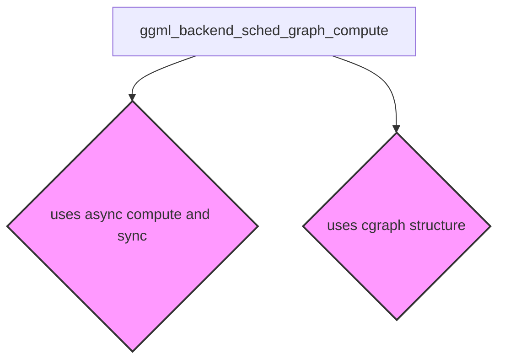

# Module: `graph_execution`

## Introduction

The `graph_execution` module, located within `ggml_backend_core.backend_scheduling.graph_resource_management`, is responsible for orchestrating the synchronous execution of computation graphs across various GGML backends. It provides a high-level interface to schedule a graph for computation and ensure its completion before returning control. This module acts as a crucial bridge between the graph definition and the underlying backend's scheduling mechanisms.

## Core Functionality

The primary function of this module is `ggml_backend_sched_graph_compute`, which handles the synchronous execution of a given computation graph.

### `ggml_backend_sched_graph_compute`

```cpp
enum ggml_status ggml_backend_sched_graph_compute(ggml_backend_sched_t sched, struct ggml_cgraph * graph);
```

This function initiates the computation of a `ggml_cgraph` on a specified backend scheduler and waits for its completion.

-   **`sched`**: An instance of `ggml_backend_sched_t` representing the backend scheduler responsible for managing and executing operations on a particular hardware backend (e.g., CPU, Metal, Vulkan). This scheduler is responsible for the actual asynchronous dispatch of graph nodes. For more details, refer to the [ggml_backend_core documentation](ggml_backend_core.md).
-   **`graph`**: A pointer to a `struct ggml_cgraph` which defines the computation graph to be executed. This graph contains all the tensors and operations that need to be performed. For more details on graph structures, refer to the [ggml_core documentation](ggml_core.md).
-   **Return**: Returns an `enum ggml_status` indicating the success or failure of the graph computation.

**Workflow:**
1.  Calls `ggml_backend_sched_graph_compute_async` to submit the graph to the backend scheduler for asynchronous processing.
2.  Calls `ggml_backend_sched_synchronize` to block the current thread until all previously scheduled computations (including the one just submitted) on `sched` are completed.

This ensures that `ggml_backend_sched_graph_compute` provides a synchronous execution model, even if the underlying backend operations are asynchronous.

## Architecture and Component Relationships

The `graph_execution` module's core functionality relies on external components for asynchronous scheduling, synchronization, and graph definition.

<!-- DIAGRAM_JSON
{
    "direction": "TD",
    "nodes": [
        {"id": "ggml_backend_sched_graph_compute", "label": "ggml_backend_sched_graph_compute", "type": "component", "link": null},
        {"id": "ggml_backend_core", "label": "ggml_backend_core", "type": "external", "link": "ggml_backend_core.md"},
        {"id": "ggml_core", "label": "ggml_core", "type": "external", "link": "ggml_core.md"}
    ],
    "edges": [
        {"source": "ggml_backend_sched_graph_compute", "target": "ggml_backend_core", "label": "uses async compute and sync"},
        {"source": "ggml_backend_sched_graph_compute", "target": "ggml_core", "label": "uses cgraph structure"}
    ],
    "groups": []
}
-->


### Relationships:

-   **`ggml_backend_sched_graph_compute` and `ggml_backend_core`**: The `ggml_backend_sched_graph_compute` function internally calls `ggml_backend_sched_graph_compute_async` and `ggml_backend_sched_synchronize`. These functions are part of the broader backend scheduling and core utilities provided by the `ggml_backend_core` module, which manages the lifecycle and operations of GGML backends.
-   **`ggml_backend_sched_graph_compute` and `ggml_core`**: The function operates on a `struct ggml_cgraph`, which is a fundamental data structure defined within the `ggml_core` module. This structure represents the entire computation graph, including its nodes (operations) and tensors.

## Integration with Overall System

This `graph_execution` module is a vital part of the GGML ecosystem, providing the generic mechanism for executing computation graphs. It abstracts away the specifics of different hardware backends by relying on the `ggml_backend_sched_t` interface. This allows higher-level GGML components to schedule graph computations without needing to know the low-level details of CPU, Metal, Vulkan, or other backend implementations.

It is important to note that while this module provides generic backend graph execution, specific backends (like the CPU backend) might also have their own specialized graph computation functions (e.g., `ggml_graph_compute_with_ctx` and `ggml_graph_compute_secondary_thread` found in the `ggml_cpu_backend` module). These specialized functions often optimize for the specific characteristics of their hardware, while `ggml_backend_sched_graph_compute` offers a unified, synchronous API for general backend scheduling.
