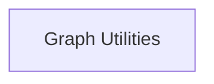

# Graph Introspection and Debug Module

## Introduction
The `graph_introspection_and_debug` module provides essential tools for understanding and debugging computation graphs within the GGML backend. It allows developers to visualize graph structures and analyze their resource overhead, crucial for performance optimization and error detection.

## Architecture Overview
This module is a part of the `ggml_graph_management` sub-module within the larger `ggml_core`. It offers functionalities that interact directly with the computation graph to extract information and represent it in an understandable format.

<!-- DIAGRAM_JSON
{
    "direction": "TD",
    "nodes": [
        {"id": "graph_utilities", "label": "Graph Utilities", "type": "module", "link": "graph_utilities.md"}
    ],
    "edges": [],
    "groups": []
}
-->

## Sub-modules

### Graph Utilities ([graph_utilities.md](graph_utilities.md))
This sub-module contains core functions for graph analysis, such as dumping graph structures to DOT files for visualization and calculating the memory overhead of a graph.