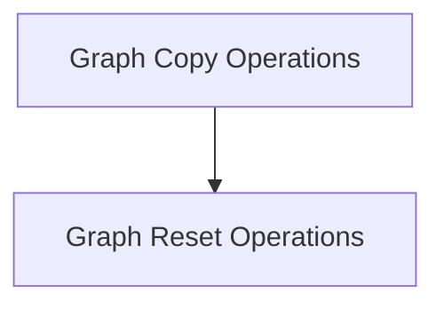
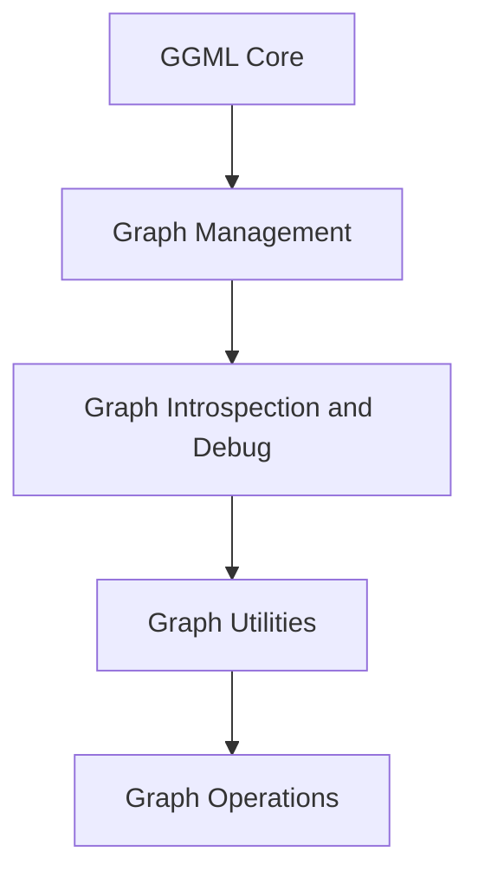

# Graph Operations Module
# Graph Operations Module Documentation

## Introduction and Purpose

The `graph_operations` module is a critical component within the `ggml_core` module, specifically residing under `ggml_graph_management` and `graph_state_management`. Its primary purpose is to provide fundamental utilities for manipulating and managing the state of GGML computation graphs. This includes copying graph structures and resetting graph states for operations like backpropagation and optimization.

## Architecture Overview

The `graph_operations` module consists of two main functional areas: graph copying and graph resetting. These sub-modules work in conjunction with the broader GGML graph management system to ensure efficient and correct computation graph execution and manipulation.

<!-- DIAGRAM_JSON
{
    "direction": "TD",
    "nodes": [
        {"id": "graph_copy_operations", "label": "Graph Copy Operations", "type": "module", "link": "graph_copy_operations.md"},
        {"id": "graph_reset_operations", "label": "Graph Reset Operations", "type": "module", "link": "graph_reset_operations.md"}
    ],
    "edges": [
        {"source": "graph_copy_operations", "target": "graph_reset_operations"}
    ],
    "groups": []
}
-->

## High-Level Functionality

### [Graph Copy Operations](graph_copy_operations.md)
This sub-module is responsible for duplicating GGML computation graphs. It ensures that all structural components, including nodes, leafs, and associated gradient information, are accurately copied from a source graph to a destination graph. This is crucial for scenarios requiring graph persistence or parallel processing of graph structures.

### [Graph Reset Operations](graph_reset_operations.md)
This sub-module provides utilities for resetting the state of a GGML computation graph. It handles the initialization of gradients (setting loss node gradients to 1.0 and others to 0) and clears optimization-related momenta, such as those used in AdamW, preparing the graph for new computation passes or iterative optimization steps.

## Introduction

The `graph_operations` module provides essential utilities for managing and inspecting computation graphs within the GGML backend. It offers functionalities for visualizing graph structures and calculating their memory overhead, aiding in debugging and performance optimization.

## Architecture

The `graph_operations` module is a sub-module of `graph_utilities`, which is part of the broader `ggml_core` module's graph management capabilities. It directly interacts with the core graph structures to provide its utility functions.

<!-- DIAGRAM_JSON
{
    "direction": "TD",
    "nodes": [
        {"id": "ggml_core", "label": "GGML Core", "type": "module", "link": "ggml_core.md"},
        {"id": "ggml_graph_management", "label": "Graph Management", "type": "module", "link": "ggml_graph_management.md"},
        {"id": "graph_introspection_and_debug", "label": "Graph Introspection and Debug", "type": "module", "link": "graph_introspection_and_debug.md"},
        {"id": "graph_utilities", "label": "Graph Utilities", "type": "module", "link": "graph_utilities.md"},
        {"id": "graph_operations", "label": "Graph Operations", "type": "module", "link": "graph_operations.md"}
    ],
    "edges": [
        {"source": "ggml_core", "target": "ggml_graph_management"},
        {"source": "ggml_graph_management", "target": "graph_introspection_and_debug"},
        {"source": "graph_introspection_and_debug", "target": "graph_utilities"},
        {"source": "graph_utilities", "target": "graph_operations"}
    ],
    "groups": []
}
-->

## Core Functionality

This module contains the following key components:

### `ggml_graph_dump_dot`

This function is responsible for generating a Graphviz DOT file representation of a `ggml_cgraph` computation graph. It provides a visual aid for understanding the structure and flow of operations within the graph.

**Key Features:**
-   **Node Representation:** Each tensor in the graph is represented as a node, displaying its name, data type, dimensions, and the operation it performs.
-   **Gradient Information:** Nodes with associated gradients are highlighted, and the gradient's operation symbol is displayed.
-   **Parameter and Leaf Node Highlighting:** Parameters are colored yellow, and leaf (constant) nodes are colored pink, with their values displayed if they are small enough.
-   **Edge Representation:** Arrows depict the data flow between tensors based on their source dependencies.
-   **Debugging and Analysis:** The generated DOT file can be processed by Graphviz tools (e.g., `dot -Tpng <file>.dot -o <file>.png`) to produce visual diagrams, which are invaluable for debugging complex graph structures.

### `ggml_graph_overhead`

This function calculates and returns the memory overhead associated with a computation graph.

**Key Features:**
-   **Memory Management:** Provides insights into the memory footprint required by the graph structure itself, assisting in efficient memory allocation and planning.
-   **Performance Optimization:** Helps developers understand the memory implications of different graph configurations and optimize for memory usage.

## Relationships to Other Modules

-   **[ggml_core](ggml_core.md)**: This module is a direct part of the `ggml_core` which provides the fundamental building blocks for tensor operations and computation graph management.
-   **[ggml_graph_management](ggml_graph_management.md)**: `graph_operations` is contained within the graph management hierarchy, leveraging the core graph structures defined there.
-   **[graph_introspection_and_debug](graph_introspection_and_debug.md)**: As its name suggests, this module is closely related to graph introspection and debugging, providing tools for understanding and visualizing the graph.
-   **[graph_utilities](graph_utilities.md)**: `graph_operations` is a sub-module of `graph_utilities`, offering specific utility functions for graph manipulation and analysis.
