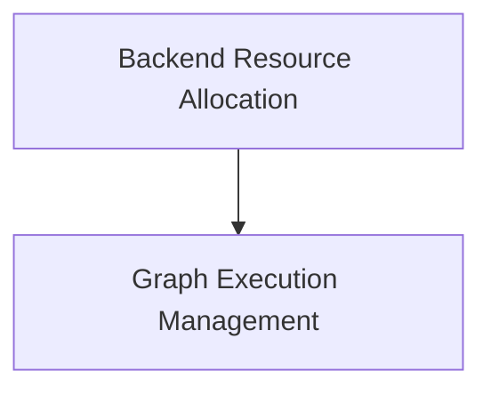

# Graph Resource Management

## Introduction

The `graph_resource_management` module is a crucial component within the `ggml_backend_core`'s backend scheduling system. It is responsible for orchestrating the execution of computation graphs and managing the allocation and reservation of necessary memory resources across various backends. This ensures efficient and synchronized processing of machine learning workloads.

## Architecture Overview

This module integrates with the overall GGML backend architecture to provide robust graph computation and resource allocation capabilities. It leverages a global allocator (`ggml_gallocr`) for memory management and interacts with individual backend interfaces for backend-specific resource reservations.

<!-- DIAGRAM_JSON
{
    "direction": "TD",
    "nodes": [
        {"id": "graph_execution", "label": "Graph Execution Management", "type": "module", "link": "graph_execution.md"},
        {"id": "resource_allocation", "label": "Backend Resource Allocation", "type": "module", "link": "resource_allocation.md"}
    ],
    "edges": [
        {"source": "resource_allocation", "target": "graph_execution"}
    ],
    "groups": []
}
-->

## Sub-modules

### [Graph Execution Management](graph_execution.md)

This sub-module focuses on the actual execution of computation graphs. It handles the asynchronous computation of graphs and ensures proper synchronization within the GGML backend scheduler.

### [Backend Resource Allocation](resource_allocation.md)

This sub-module is responsible for the critical task of reserving and allocating memory resources for computation graphs. It includes functionalities for measuring required memory sizes, splitting graphs for allocation, and coordinating with specific backend implementations for resource provisioning.