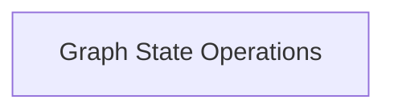

# Graph State Management

The `graph_state_management` module, a key part of `ggml_graph_management` within the `ggml_core` library, is responsible for fundamental operations related to the state of computation graphs. It provides utilities for copying and resetting graph states, which are crucial for tasks like training iterations, model serialization, or dynamic graph manipulation.

## Architecture

This module primarily encapsulates operations that directly modify or copy the internal data structures of a `ggml_cgraph`. It ensures consistent and correct handling of graph nodes, leafs, visited hash sets, and gradient accumulators.

<!-- DIAGRAM_JSON
{
    "direction": "TD",
    "nodes": [
        {"id": "graph_operations", "label": "Graph State Operations", "type": "module", "link": "graph_operations.md"}
    ],
    "edges": [],
    "groups": []
}
-->

## Sub-modules

### [Graph State Operations](graph_operations.md)
This sub-module contains the core functionalities for manipulating the state of a computation graph. It includes functions for deep copying graph structures and resetting various graph-related values, such as gradients and optimizer momenta, crucial for iterative processes like neural network training.
