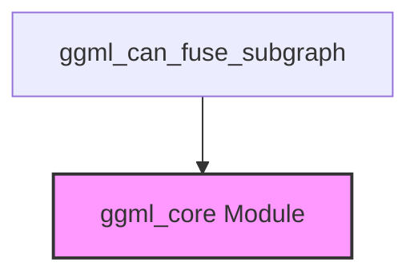
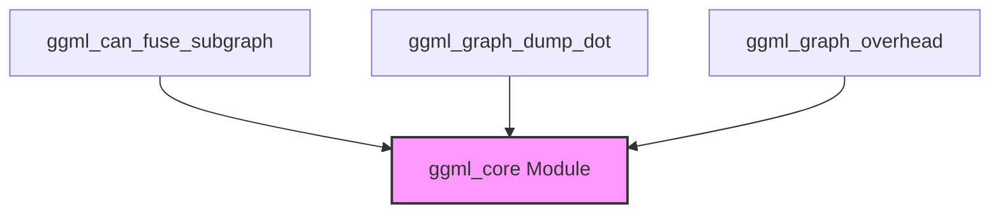
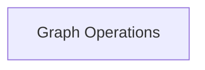

# graph_utilities Module Documentation

## Introduction

The `graph_utilities` module, located within `ggml_internal_utils`, provides specialized utilities for analyzing and optimizing computation graphs within the GGML framework. Its primary purpose is to assist in low-level graph optimizations, particularly in identifying fusible subgraphs for improved performance.

## Core Functionality

This module contains a key utility function that operates on the `ggml_cgraph` structure for graph analysis.

### `ggml_can_fuse_subgraph`

```c
static inline bool ggml_can_fuse_subgraph(const struct ggml_cgraph * cgraph,
                                          int                        node_idx,
                                          int                        count,
                                          const enum ggml_op *       ops,
                                          const int *                outputs,
                                          int                        num_outputs) {
    GGML_ASSERT(count < 32);
    if (node_idx + count > cgraph->n_nodes) {
        return false;
    }

    int idxs[32];

    for (int i = 0; i < count; ++i) {
        idxs[i] = node_idx + i;
    }

    return ggml_can_fuse_subgraph_ext(cgraph, idxs, count, ops, outputs, num_outputs);
}
```

This function is designed to determine if a contiguous sequence of computational nodes within a GGML graph (`cgraph`) can be logically fused into a single, more efficient operation. This check is critical for graph optimization passes that aim to reduce computational overhead and improve execution performance by combining elementary operations.

-   **`cgraph`**: The computation graph being analyzed. This structure is defined in the [ggml_core module](ggml_core.md).
-   **`node_idx`**: The starting index of the sequence of nodes to consider for fusion.
-   **`count`**: The number of nodes in the sequence to check.
-   **`ops`**: An array of `ggml_op` enumerations representing the expected operations in the subgraph.
-   **`outputs`**: An array indicating which nodes in the subgraph produce outputs that are used externally.
-   **`num_outputs`**: The number of external outputs from the subgraph.

The function ensures that the requested `count` of nodes does not exceed the graph's bounds and then delegates the actual fusion logic to `ggml_can_fuse_subgraph_ext`.

## Architecture and Component Relationships

The `graph_utilities` module is a focused utility module, primarily providing the `ggml_can_fuse_subgraph` function. It depends on the core GGML graph structures and enumerations defined in the [ggml_core module](ggml_core.md).

<!-- DIAGRAM_JSON
{
    "direction": "TD",
    "nodes": [
        {"id": "ggml_can_fuse_subgraph", "label": "ggml_can_fuse_subgraph", "type": "component", "link": null},
        {"id": "ggml_core", "label": "ggml_core Module", "type": "external", "link": "ggml_core.md"}
    ],
    "edges": [
        {"source": "ggml_can_fuse_subgraph", "target": "ggml_core"}
    ],
    "groups": []
}
-->


## System Integration

This `graph_utilities` module plays a specific role in the GGML optimization pipeline. It is utilized by higher-level graph optimization routines (likely found in modules like `ggml_optimizer` or `ggml_core.ggml_graph_management`) to intelligently identify and group operations that can be combined for efficiency gains. Its low-level graph analysis capabilities are fundamental for enabling aggressive and safe graph transformations that enhance model execution speed and reduce memory footprint.

## Introduction

The `graph_utilities` module provides essential functionalities for analyzing, debugging, and optimizing computation graphs within the GGML framework. It offers tools to inspect the structure, identify optimization opportunities, and understand the performance characteristics of neural network computational graphs.

## Core Functionality

This module contains utilities that primarily interact with the `ggml_cgraph` structure, enabling detailed introspection and analysis.

### `ggml_can_fuse_subgraph`

```c
static inline bool ggml_can_fuse_subgraph(const struct ggml_cgraph * cgraph,
                                          int                        node_idx,
                                          int                        count,
                                          const enum ggml_op *       ops,
                                          const int *                outputs,
                                          int                        num_outputs) {
    GGML_ASSERT(count < 32);
    if (node_idx + count > cgraph->n_nodes) {
        return false;
    }

    int idxs[32];

    for (int i = 0; i < count; ++i) {
        idxs[i] = node_idx + i;
    }

    return ggml_can_fuse_subgraph_ext(cgraph, idxs, count, ops, outputs, num_outputs);
}
```

This function is designed to determine if a contiguous sequence of computational nodes within a GGML graph (`cgraph`) can be logically fused into a single, more efficient operation. This check is critical for graph optimization passes that aim to reduce computational overhead and improve execution performance by combining elementary operations.

-   **`cgraph`**: The computation graph being analyzed.
-   **`node_idx`**: The starting index of the sequence of nodes to consider for fusion.
-   **`count`**: The number of nodes in the sequence to check.
-   **`ops`**: An array of `ggml_op` enumerations representing the expected operations in the subgraph.
-   **`outputs`**: An array indicating which nodes in the subgraph produce outputs that are used externally.
-   **`num_outputs`**: The number of external outputs from the subgraph.

The function ensures that the requested `count` of nodes does not exceed the graph's bounds and then calls `ggml_can_fuse_subgraph_ext` for the actual fusion logic.

### `ggml_graph_dump_dot`

(Reference: Defined in [ggml_core.md](ggml_core.md))

This utility is responsible for generating a Graphviz DOT representation of a GGML computation graph. The DOT format allows for easy visualization of the graph structure using tools like Graphviz, which is invaluable for debugging, understanding complex model architectures, and verifying the correctness of graph transformations.

### `ggml_graph_overhead`

(Reference: Defined in [ggml_core.md](ggml_core.md))

This component is used to calculate or report the computational overhead associated with a GGML graph or specific parts of it. It's a vital tool for performance analysis, helping developers identify bottlenecks and areas where optimization efforts would yield the most significant improvements.

## Architecture and Component Relationships

The `graph_utilities` module primarily consists of functions that analyze and report on the state of GGML computation graphs. It operates closely with the core graph management functionalities, often consuming `ggml_cgraph` structures produced and managed by the [ggml_core module](ggml_core.md).

<!-- DIAGRAM_JSON
{
    "direction": "TD",
    "nodes": [
        {"id": "ggml_can_fuse_subgraph", "label": "ggml_can_fuse_subgraph", "type": "component", "link": null},
        {"id": "ggml_graph_dump_dot", "label": "ggml_graph_dump_dot", "type": "component", "link": null},
        {"id": "ggml_graph_overhead", "label": "ggml_graph_overhead", "type": "component", "link": null},
        {"id": "ggml_core", "label": "ggml_core Module", "type": "external", "link": "ggml_core.md"}
    ],
    "edges": [
        {"source": "ggml_can_fuse_subgraph", "target": "ggml_core"},
        {"source": "ggml_graph_dump_dot", "target": "ggml_core"},
        {"source": "ggml_graph_overhead", "target": "ggml_core"}
    ],
    "groups": []
}
-->


## System Integration

The `graph_utilities` module is an essential diagnostic and optimization layer within the GGML backend. It provides the necessary tools for developers and automated systems to:

1.  **Verify Graph Correctness**: By visualizing the graph using `ggml_graph_dump_dot`, developers can visually confirm that the computational graph accurately represents the desired neural network architecture.
2.  **Identify Optimization Opportunities**: `ggml_can_fuse_subgraph` helps in programmatically detecting subgraphs that can be optimized for better performance, leading to more efficient execution plans.
3.  **Analyze Performance Characteristics**: `ggml_graph_overhead` allows for profiling the graph to pinpoint performance bottlenecks and areas that require further optimization.
4.  **Support Advanced Graph Transformations**: The utilities lay the groundwork for more complex graph transformation and optimization passes implemented in other parts of the GGML ecosystem.

It acts as a crucial analytical component, working hand-in-hand with the [ggml_core module](ggml_core.md) to ensure the efficient and reliable operation of GGML-based models.
## Introduction and Purpose

The `graph_utilities` module is a core component within the `ggml_graph_introspection_and_debug` module, providing essential functionalities for visualizing and analyzing computation graphs. Its primary purpose is to aid in debugging and understanding the structure and memory consumption of `ggml` graphs.

## Architecture Overview

The `graph_utilities` module is composed of a single sub-module, `graph_operations`, which encapsulates the core logic for graph visualization and overhead calculation.

<!-- DIAGRAM_JSON
{
    "direction": "TD",
    "nodes": [
        {"id": "graph_operations", "label": "Graph Operations", "type": "module", "link": "graph_operations.md"}
    ],
    "edges": [],
    "groups": []
}
-->


## Sub-modules

### [Graph Operations](graph_operations.md)
This sub-module provides utilities for dumping graph structures into DOT format for visualization and calculating the memory overhead of a computation graph.
