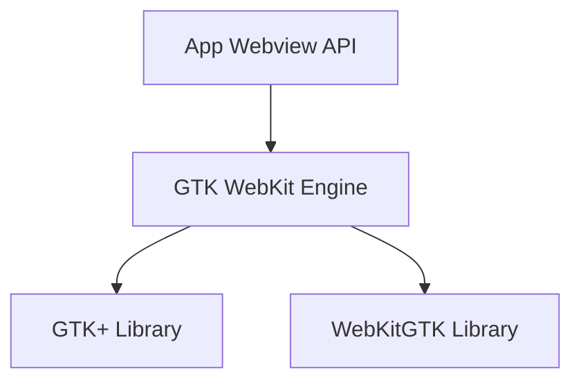

# `gtk_engine` Module Documentation

## Introduction

The `gtk_engine` module provides the GTK/WebKit-based implementation for the application's WebView functionality. It serves as a platform-specific backend within the broader `app_webview_api.platform_engines` system, enabling the application to render web content on Linux environments utilizing the GTK toolkit and WebKitGTK engine.

This module is critical for ensuring cross-platform compatibility by offering a concrete implementation of the WebView interface tailored for GTK-based desktop environments.

## Architecture and Core Functionality

The `gtk_engine` module primarily encapsulates the `gtk_webkit_engine` component, which is responsible for managing the lifecycle of a `WebKitWebView` widget and its associated `GtkWindow`.

### `gtk_webkit_engine`

The `gtk_webkit_engine` class is the central component of this module. Its core responsibilities include:

*   **WebView Management**: Initializing, displaying, and destroying the `WebKitWebView` widget that renders web content.
*   **Window Management**: Creating, managing, and destroying the `GtkWindow` that hosts the WebView, particularly when the engine is designated as the window owner (`m_owns_window`).
*   **Resource Cleanup**: Ensuring proper release of GTK and WebKit resources upon destruction to prevent memory leaks and handle application shutdown gracefully.
*   **Event Handling**: Disconnecting signal handlers from the GTK window during destruction to prevent invalid callbacks.
*   **Run Loop Interaction**: Potentially interacting with the GTK event loop to ensure immediate window closure and proper resource deallocation.

This component directly interacts with GTK+ and WebKitGTK libraries to provide the underlying platform-specific web rendering capabilities.

### Module Relationships

The `gtk_engine` module is a sub-module of `app_webview_api.platform_engines`. It provides a concrete implementation of the abstract WebView interface defined by the [app_webview_api](app_webview_api.md). The application's WebView layer delegates to this module when running on a GTK-compatible system.

<!-- DIAGRAM_JSON
{
    "direction": "TD",
    "nodes": [
        {"id": "gtk_webkit_engine", "label": "GTK WebKit Engine", "type": "component", "link": null},
        {"id": "gtk_library", "label": "GTK+ Library", "type": "external", "link": null},
        {"id": "webkit_gtk_library", "label": "WebKitGTK Library", "type": "external", "link": null},
        {"id": "app_webview_api", "label": "App Webview API", "type": "external", "link": "app_webview_api.md"}
    ],
    "edges": [
        {"source": "gtk_webkit_engine", "target": "gtk_library"},
        {"source": "gtk_webkit_engine", "target": "webkit_gtk_library"},
        {"source": "app_webview_api", "target": "gtk_webkit_engine"}
    ],
    "groups": []
}
-->

## Integration with the Overall System

The `gtk_engine` module is a key part of the `app_webview_api.platform_engines` family, which includes other platform-specific engines like `win32_engine` and `cocoa_engine`. This architecture allows the application to abstract away the underlying WebView implementation details, providing a unified API for web content rendering across different operating systems.

When the application initializes its WebView component, it dynamically selects and loads the appropriate platform engine (e.g., `gtk_engine` on Linux, `win32_engine` on Windows, `cocoa_engine` on macOS). This modular design ensures that platform-specific code is isolated and interchangeable, simplifying maintenance and extending support to new platforms.

By implementing the necessary interfaces and adhering to the `app_webview_api` contract, the `gtk_engine` seamlessly integrates into the broader application, providing robust web rendering capabilities for GTK-based environments.
