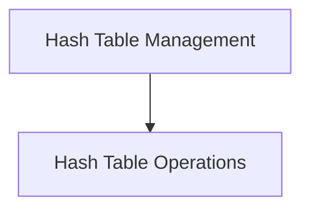

# Hash Table Management Module

## Introduction
The `hash_table_management` module provides essential utilities for managing hash table data structures within the system. It encapsulates core operations such as checking for the existence of elements and inserting new ones, ensuring efficient data lookup and storage.

## Architecture Overview
This module is designed to offer a streamlined interface for hash table interactions. It primarily consists of the `hash_operations` sub-module, which handles the fundamental mechanics of hash table manipulation.

<!-- DIAGRAM_JSON
{
    "direction": "TD",
    "nodes": [
        {"id": "hash_operations", "label": "Hash Table Operations", "type": "module", "link": "hash_operations.md"}
    ],
    "edges": [],
    "groups": []
}
-->

## Sub-modules

### Hash Table Operations (`hash_operations`)
The `hash_operations` sub-module is responsible for the core functionalities related to hash table management, including efficient searching and insertion of elements. For more details, refer to the [Hash Table Operations documentation](hash_operations.md).