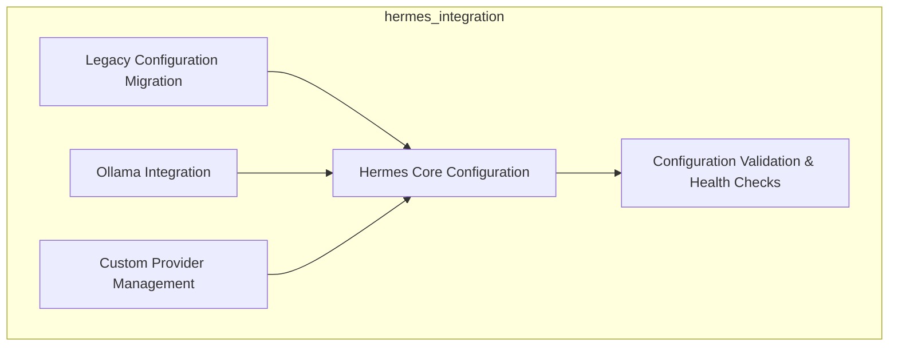

# hermes_integration
This module manages the configuration and integration of the Hermes AI platform, focusing on Ollama provider setup, configuration validation, and migration of legacy settings.

<!-- DIAGRAM_JSON
{
  "nodes": [
    { "id": "A", "label": "Legacy Configuration Migration" },
    { "id": "B", "label": "Hermes Core Configuration" },
    { "id": "C", "label": "Ollama Integration" },
    { "id": "D", "label": "Custom Provider Management" },
    { "id": "E", "label": "Configuration Validation & Health Checks" }
  ],
  "edges": [
    { "source": "A", "target": "B" },
    { "source": "C", "target": "B" },
    { "source": "D", "target": "B" },
    { "source": "B", "target": "E" }
  ],
  "groups": [
    {
      "id": "hermes_integration_group",
      "label": "hermes_integration",
      "nodes": ["A", "B", "C", "D", "E"]
    }
  ]
}
-->
