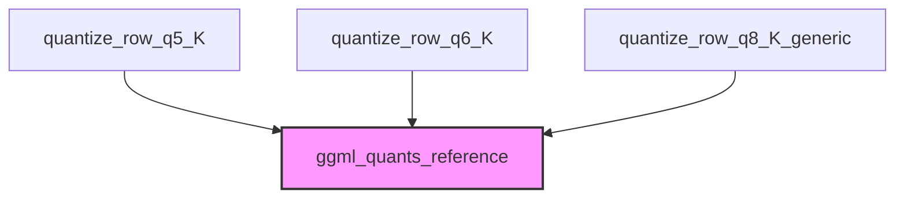

# Module: high_bit_quantization

## Introduction
The `high_bit_quantization` module is a crucial part of the `ggml-cpu` backend, specifically designed for optimizing the storage and computation of neural network models by quantizing floating-point numbers into higher-bit integer representations. This module provides functions for quantizing rows of floating-point data into 5-bit, 6-bit, and 8-bit `K` quantized formats, which are essential for reducing model size and improving inference speed on CPU architectures. These high-bit quantization schemes aim to strike a balance between aggressive compression and maintaining model accuracy, often used for specific layers or parts of a model where higher precision is still beneficial.

## Architecture and Component Relationships

The `high_bit_quantization` module exposes a set of functions that act as entry points for different high-bit quantization schemes. These functions internally rely on more generic or reference implementations for the actual quantization logic.

### Components

*   `quantize_row_q5_K`: Quantizes a row of floating-point numbers into the `Q5_K` format.
*   `quantize_row_q6_K`: Quantizes a row of floating-point numbers into the `Q6_K` format.
*   `quantize_row_q8_K_generic`: Quantizes a row of floating-point numbers into the `Q8_K` format using a generic reference implementation.

<!-- DIAGRAM_JSON
{
    "direction": "TD",
    "nodes": [
        {"id": "quantize_row_q5_K", "label": "quantize_row_q5_K", "type": "component", "link": null},
        {"id": "quantize_row_q6_K", "label": "quantize_row_q6_K", "type": "component", "link": null},
        {"id": "quantize_row_q8_K_generic", "label": "quantize_row_q8_K_generic", "type": "component", "link": null},
        {"id": "ggml_quants_reference", "label": "ggml_quants_reference", "type": "external", "link": "ggml_quants_reference.md"}
    ],
    "edges": [
        {"source": "quantize_row_q5_K", "target": "ggml_quants_reference"},
        {"source": "quantize_row_q6_K", "target": "ggml_quants_reference"},
        {"source": "quantize_row_q8_K_generic", "target": "ggml_quants_reference"}
    ],
    "groups": []
}
-->

## How it Fits into the Overall System
The `high_bit_quantization` module plays a vital role within the `ggml-cpu` backend, specifically within the broader `ggml_cpu_quants_generic` and `k_row_quantization` modules. It provides the specific high-bit quantization implementations necessary for efficient model inference on CPU.

This module is typically used during the loading and processing of quantized models (e.g., GGUF format) where weights are stored in these optimized `Q5_K`, `Q6_K`, and `Q8_K` formats. Other modules, such as those involved in model loading, tensor operations, and graph execution, will call these quantization functions to convert unquantized data or to prepare data for quantized operations.

For more details on generic quantization implementations, refer to the [ggml_quants_reference.md](ggml_quants_reference.md) documentation.
For a broader understanding of CPU-specific quantization, see [ggml_cpu_quants_generic.md](ggml_cpu_quants_generic.md).