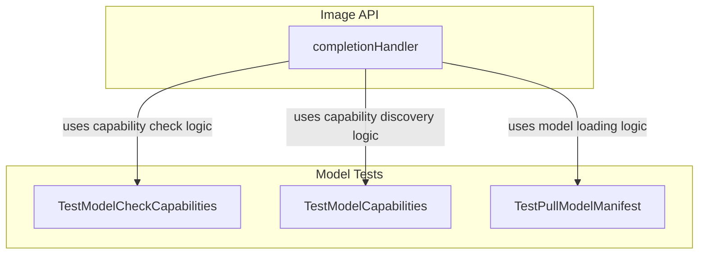

# image_api_and_capabilities
This module provides an API endpoint for image generation and includes tests for model capability checking, discovery, and manifest pulling, ensuring robust image processing functionalities.

<!-- DIAGRAM_JSON
{
    "nodes": [
        {
            "id": "A",
            "label": "TestModelCheckCapabilities"
        },
        {
            "id": "B",
            "label": "TestModelCapabilities"
        },
        {
            "id": "C",
            "label": "TestPullModelManifest"
        },
        {
            "id": "D",
            "label": "completionHandler"
        }
    ],
    "edges": [
        {
            "source": "D",
            "target": "A",
            "label": "uses capability check logic"
        },
        {
            "source": "D",
            "target": "B",
            "label": "uses capability discovery logic"
        },
        {
            "source": "D",
            "target": "C",
            "label": "uses model loading logic"
        }
    ],
    "groups": [
        {
            "id": "tests",
            "label": "Model Tests",
            "nodes": [
                "A",
                "B",
                "C"
            ]
        },
        {
            "id": "api",
            "label": "Image API",
            "nodes": [
                "D"
            ]
        }
    ]
}
-->
