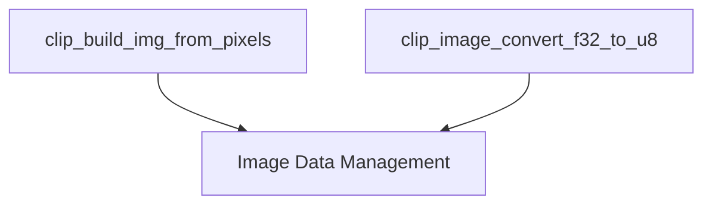

# `image_conversion_utilities` Module Documentation

## Introduction

The `image_conversion_utilities` module is a vital component within the `llama.cpp`'s multi-modal CLIP (Contrastive Language-Image Pre-training) implementation, specifically focusing on the foundational tasks of image data format conversion. It provides essential utilities for converting raw pixel data into a structured image format and for transforming image data between floating-point and 8-bit unsigned integer representations.

This module ensures that image data is in the correct format for subsequent processing, normalization, and inference steps within the CLIP pipeline.

## Architecture and Component Relationships

The `image_conversion_utilities` module is a leaf module responsible for low-level image data manipulation. It primarily interacts with image data structures (like `clip_image_u8` and `clip_image_f32`) which are likely defined within the broader `image_data_management` module or its parent `clip_image_basic_ops`.

<!-- DIAGRAM_JSON
{
    "direction": "TD",
    "nodes": [
        {"id": "build_from_pixels", "label": "clip_build_img_from_pixels", "type": "component", "link": null},
        {"id": "convert_f32_to_u8", "label": "clip_image_convert_f32_to_u8", "type": "component", "link": null},
        {"id": "image_data_management", "label": "Image Data Management", "type": "external", "link": "image_data_management.md"}
    ],
    "edges": [
        {"source": "build_from_pixels", "target": "image_data_management"},
        {"source": "convert_f32_to_u8", "target": "image_data_management"}
    ],
    "groups": []
}
-->



## Core Functionality

The module exposes two primary functions:

### `clip_build_img_from_pixels`

This function takes raw RGB pixel data, along with the image dimensions, and populates a `clip_image_u8` structure. It handles the memory allocation and copying of pixel data, preparing it for further processing in an 8-bit unsigned integer format.

- **Input:** Raw `unsigned char` array representing RGB pixels, image width (`nx`), image height (`ny`), and a pointer to a `clip_image_u8` structure.
- **Output:** The provided `clip_image_u8` structure is populated with the image data.

```cpp
void clip_build_img_from_pixels(const unsigned char * rgb_pixels, int nx, int ny, clip_image_u8 * img) {
    img->nx = nx;
    img->ny = ny;
    img->buf.resize(3 * nx * ny);
    memcpy(img->buf.data(), rgb_pixels, img->buf.size());
}
```

### `clip_image_convert_f32_to_u8`

This utility converts an image from a floating-point representation (`clip_image_f32`) to an 8-bit unsigned integer format (`clip_image_u8`). It scales the floating-point values (assumed to be in the range `[0.0, 1.0]`) to `[0, 255]` and clamps them to ensure valid 8-bit pixel values.

- **Input:** A constant reference to a `clip_image_f32` source image and a reference to a `clip_image_u8` destination image.
- **Output:** The `clip_image_u8` destination is populated with the converted image data.

```cpp
static void clip_image_convert_f32_to_u8(const clip_image_f32& src, clip_image_u8& dst) {
    dst.nx = src.nx;
    dst.ny = src.ny;
    dst.buf.resize(3 * src.nx * src.ny);
    for (size_t i = 0; i < src.buf.size(); ++i) {
        dst.buf[i] = static_cast<uint8_t>(std::min(std::max(int(src.buf[i] * 255.0f), 0), 255));
    }
}
```

## How it Fits into the Overall System

The `image_conversion_utilities` module is located deep within the `llama_cpp_mtmd_clip` hierarchy, specifically under `clip_image_processing` -> `clip_image_basic_ops` -> `image_data_management` -> `image_format_conversion`. This placement highlights its role as a foundational utility for handling image data types and formats essential for the CLIP multi-modal processing capabilities of `llama.cpp`.

It serves as a critical step in the image processing pipeline, ensuring that images are correctly prepared and converted before being fed into neural networks or other computational processes. Its functionality is leveraged by higher-level image processing components that require specific image data representations.