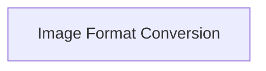

# Image Data Management

The `image_data_management` module is a crucial component within the `clip_image_basic_ops` sub-system, primarily responsible for fundamental image data handling and format conversion operations. It provides utilities for building image structures from raw pixel data and converting between different internal image representations (e.g., float to unsigned 8-bit integers).

## Architecture Overview

The module's architecture is straightforward, focusing on efficient image data manipulation. It currently comprises a single sub-module dedicated to image format conversion.

<!-- DIAGRAM_JSON
{
    "direction": "TD",
    "nodes": [
        {"id": "image_format_conversion", "label": "Image Format Conversion", "type": "module", "link": "image_format_conversion.md"}
    ],
    "edges": [],
    "groups": []
}
-->

## Sub-modules

### [Image Format Conversion](image_format_conversion.md)
This sub-module handles the core logic for converting image data between different precision types and constructing image objects. It contains functions essential for preparing image data for further processing within the CLIP system.
