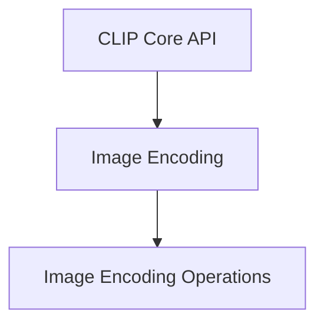

# Image Encoding Module

The `image_encoding` module is a crucial part of the `llama_cpp_mtmd_clip` (Multi-modal CLIP) system, specifically residing within the `clip_core_api` sub-module. Its primary purpose is to handle the processing and encoding of image data into a format suitable for consumption by the CLIP model.

This module provides the core functionalities for transforming raw image data into numerical representations (embeddings) that the CLIP model can understand and use for tasks like image-text matching or zero-shot classification.

## Architecture Overview

The `image_encoding` module contains the `image_encoding_operations` sub-module, which encapsulates the specific functions responsible for image encoding and debugging. This structure ensures a clear separation of concerns, making the module easier to understand, maintain, and extend.

<!-- DIAGRAM_JSON
{
    "direction": "TD",
    "nodes": [
        {"id": "clip_core_api", "label": "CLIP Core API", "type": "module", "link": "clip_core_api.md"},
        {"id": "image_encoding", "label": "Image Encoding", "type": "module", "link": "image_encoding.md"},
        {"id": "image_encoding_operations", "label": "Image Encoding Operations", "type": "module", "link": "image_encoding_operations.md"}
    ],
    "edges": [
        {"source": "clip_core_api", "target": "image_encoding"},
        {"source": "image_encoding", "target": "image_encoding_operations"}
    ],
    "groups": []
}
-->

## Sub-modules

### [Image Encoding Operations](image_encoding_operations.md)

This sub-module contains the core logic for encoding float images into vectors and provides debugging utilities for the encoding process. It is responsible for preparing image data for the CLIP model.

### Core Components:

*   `llama.llama.cpp.tools.mtmd.clip.clip_encode_float_image`:
    This function takes a `clip_ctx` (CLIP context), number of threads, a float array representing the image (`img`), its height (`h`) and width (`w`), and an output float vector (`vec`). It converts the input float image into a `clip_image_f32` structure and then calls `clip_image_encode` to generate the image embedding. It returns `true` on successful encoding.

*   `llama.llama.cpp.tools.mtmd.clip.clip_debug_encode`:
    This function is used for debugging the image encoding process. It initializes a `clip_image_f32` with a specified fill value, temporarily enables debug graphing within the `clip_ctx`, and then calls `clip_image_encode`. It asserts that the image buffer is empty after encoding, indicating a successful debug run. This is useful for verifying the internal workings of the image encoding pipeline without relying on external image input.